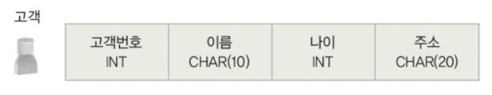
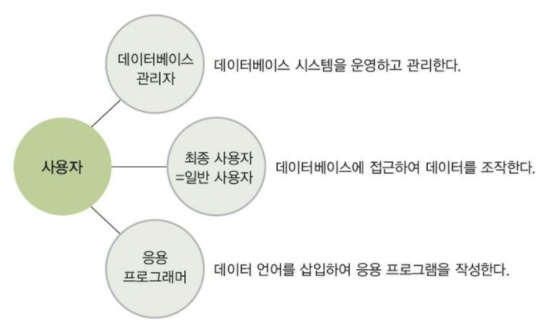
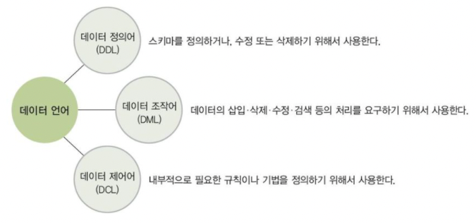
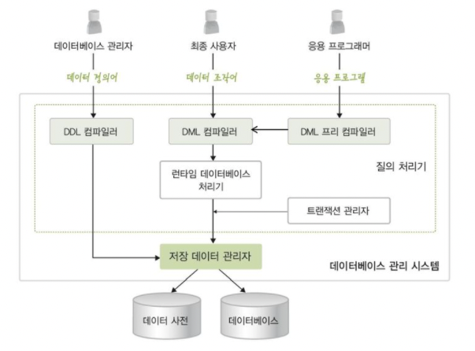

# 03 데이터베이스 시스템

### 01 데이터베이스 시스템의 정의

데이터베이스, 데이터베이스 관리 시스템, 데이터베이스 시스템을 같은 의미로 사용하지만 각 용어의 개념을 구분하고 관계를 명확히 이해할 필요가 있다.

- 데이터베이스
    - 데이터를 저장해 두는 곳, 저장된 데이터의 집합
- 데이터베이스 관리 시스템
    - 데이터베이스에 저장된 데이터가 일관되고 무결한 상태로 유지되도록 관리하는 시스템
- 데이터베이스 시스템
    - 데이터베이스와 데이터베이스 관리 시스템을 이용해 조직에 필요한 정보를 제공해주는 시스템

### 02 데이터베이스의 구조

1. **스키마**
- 스키마는 데이터베이스에 저장되는 `데이터 구조`와 `제약조건`을 정의한 것이다.
- 정의된 스키마에 따라 데이터베이스에 실제로 저장된 값을 `인스턴스`라고 한다.

1. **3단계 데이터베이스 구조**

미국의 표준화 기관인 `ANSI/SPARC` 에서 데이터베이스를 쉽게 이해 하고 이용할 수 있도록 3단계 데이터베이스 구조를 제안하였다.

3단계 데이터베이스 구조는 하나의 데이터베이스를 세 단계로 나누어 이해한다.

- 개별 사용자 관점에서 바라보는 `외부 단계`
- 조직 전체의 관점에서 바라보는 `개념 단계`
- 물리적인 저장 장치의 관점에서 바라보는 `내부단계`

**외부단계**

- `개별 사용자 관점`에서 데이터베이스를 이해하고 표현한다.
- 사용자에게 필요한 데이터베이스를 정의한 것.
- 사용자 별로 외부 스키마를 정의하여 불필요한 데이터 접근을 사전에 막아 보안 측면에도 효과적이다.

**개념단계**

- 사용자들의 관점을 통합하여, 데이터베이스를 `조직 전체의 관점`에서 이해하고 표현한다.
- 모든 사용자에게 필요한 데이터를 통합하여 전체 데이터베이스의 논리적 구조를 정의한다.
- 모든 개별 사용자가 생각하는 데이터베이스의 모습을 하나로 합친 형태.
- 일반적으로 스키마라고 한다면 개념스키마를 의미한다.

**내부단계**

- 데이터베이스를 디스크나 테이프 같은 `저장 장치의 관점`에서 이해하고 표현한다.
- 전체 데이터베이스가 저장 장치에 실제로 저장되는 방법을 정의한다.
- 개념 스키마에 대한 물리적인 저장 구조를 표현하므로 하나의 데이터베이스에 하나만 존재한다.

<aside>
💡 데이터베이스를 3단계 구조로 나누고, 단계별로 스키마를 유지하며 스키마 사이의 대응 관계를 정의하는 목적은 데이터 독립성을 실현하기 위해서이다.
데이터 독립성은 하위 스키마를 변경하더라도 상위 스키마가 영향을 받지 않는 특성을 의미한다.

</aside>

**논리적 데이터 독립성(외부/개념 사상)**

- 논리적 데이터 독립성은 개념 스키마가 변경되더라도 외부 스키마가 영향을 받지 않는 것

**물리적 데이터 독립성(개념/내부 사상)**

- 물리적 데이터 독립성은 내부 스키마가 변경되더라도 개념 스키마가 영향을 받지 않는 것

**데이터 사전**

- 데이터베이스에 저장되는 데이터에 관한 정보를 저장하는 곳을 데이터 사전 또는 카탈로그 라고 한다.
- 스키마, 사상 정보, 제약조건 등을 저장하고 있다.
- 데이터베이스 관리 시스템이 스스로 생성하고 유지한다.
- 데이터베이스 관리 시스템이 데이터 사전에 내용을 추가하거나 삭제 할 수 있는 반면, **사용자는 검색만 가능**.

**데이터 디렉토리**

데이터 사전에 있는 데이터에 실제로 접근하는 데 필요한 위치 정보를 저장하는 곳

데이터 사전은 사용자가 접근할수 있고 데이터 디렉토리는 시스템만 접근할 수 있다는 차이가 있다.

### 03 데이터베이스 사용자

데이터베이스를 이용하는 사용자는 크게 데이터베이스 관리자, 최종 사용자, 프로그래머로 나눌 수 있다.

### 04 데이터 언어

**데이터 정의어(DDL)**

데이터 정의어는 `새로운 데이터베이스를 구축`하기 위해 스키마를 정의하거나 기존 스키마 정의를 `삭제` 또는 `수정`하기 위해 사용하는 데이터 언어다.

**데이터 조작어(DML)**

데이터 조작어는 `사용자`가 데이터의 `삽입 삭제 수정 검색` 등의 처리를 데이터베이스 관리 시스템에 요구하기 위해 사용하는 데이터 언어다.

**데이터 제어어(DCL)**

데이터 제어어는 데이터베이스에 저장된 데이터를 여러 사용자가 `무결성`과 `일관성`을 유지하며 문제없이 공유할 수 있도록, 내부적으로 필요한 `규칙`이나 `기법`을 정의하는데 사용한 데이터 언어다.

- 무결성 : 데이터베이스에 정확하고 유효한 데이터만 유지한다.
- 보안 : 허가받지 않는 사용자가 데이터에 접근하는 것을 차단한다.
- 회복 : 장애가 발생하더라도 데이터의 일관성을 유지한다.
- 동시성 : 여러 사용자가 같은 데이터에 동시에 접근하여 처리할 수 있게 한다.

## 05 데이터베이스 관리 시스템의 구성

**질의 처리기**

- DDL 컴파일러
    - 데이터 정의어로 작성된 스키마의 정의를 해석
    - 저장 데이터 관리자를 통해 새로운 데이터베이스 구축, 스키마의 정의를 데이터 사전에 저장
- DML  프리 컴파일러
    - 응용 프로그램에 삽입된 데이터 조작어를 추출하여 DML 컴파일러에 전달
    - 데이터 조작어와 관련 없는 코드들은 해당 언어의 컴파일러에 보내진다.
- DML 컴파일러
    - 데이터 조작어로 작성된 데이터의 처리 요구를 분석하여 런타임 데이터베이스 처리기에 맞게 해석한다.
- 런타임 데이터베이스 처리기
    - 저장 데이터 관리자를 통해 데이터베이스에 접근, DML 컴파일러로 부터 전달받은 요구를 데이터베이스에서 실제로 실행한다.
- 트랜잭션 관리자
    - 사용자의 접근 권한을 검사하고, 무결성 유지를 위한 제약조건 위반 여부를 확인한다.
    - 회복이나 병행 수행과 관련된 작업도 담당한다.

**저장 데이터 관리자**

- 저장 데이터 관리자는 디스크에 저장된 데이터베이스와 데이터 사전을 관리, 실제로 접근하는 역할
- 운영체제의 도움을 받아 데이터베이스에 접근을 수행한다.
