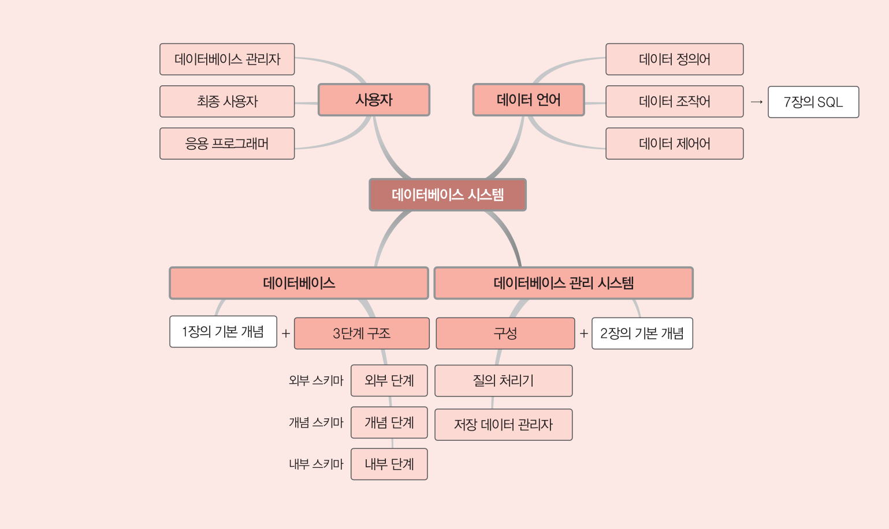
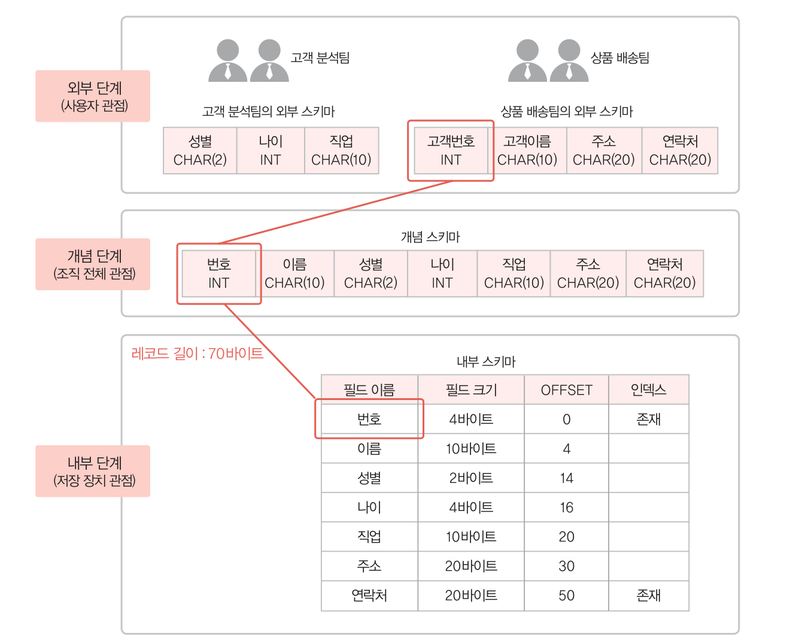
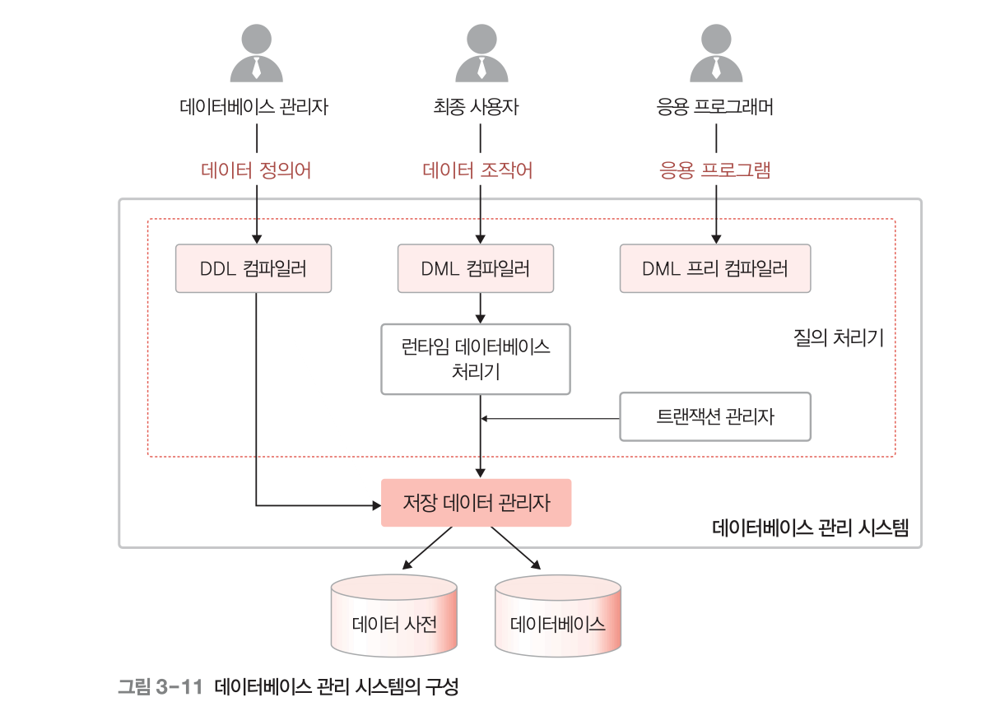

# 3장. 데이터베이스 시스템

### 학습 목표 - 데이터베이스, 데이터베이스 관리 시스템, 데이터베이스 시스템의 차이

# 1. 데이터베이스 시스템의 정의

데이터베이스 시스템 - 데이터베이스와 데이터베이스 관리 시스템을 이용해 조직에 필요한 정보를 제공해주는 **전체 시스템**. 위 그림의 중앙 부분.

---

# 2. 데이터베이스 구조

## 1) 스키마

데이터베이스에 저장되는 데이터 구조와 제약조건을 정의한 것.

스키마에 따라 데이터베이스에 실제로 저장된 값 ⇒ 인스턴스.

## 2) 3단계 데이터베이스 구조

### (1) 외부단계(외부 스키마 / 서브 스키마)

사용자 관점.

개별 사용자가 db를 어떻게 보는가를 표현 → 사용자마다 생각하는 디비 구조가 다르다 → **사용자마다 자기에게 필요한 db를 정의한 것(외부스키마)**

### (2) 개념 단계(개념 스키마)

사용자들의 관점을 통합한 것 → 모든 사용자에게 필요한 데이터를 통합한 **조직 전체 db의 논리적 구조를 정의(개념 스키마)**

일반적으로 말하는 스키마는 개념 스키마.

하나의 디비에는 하나의 개념스키마가 존재 → 사용자마다 db에 대해 달리 정의하는 외부스키마는 개념 스키마의 일부분.

### (3) 내부 단계

저장 장치 관점.

db를 디스크같은 저장장치 관점에서 이해하고 표현.

**실제로 저장되는 방법을 정의(내부 스키마).**

데이터를 저장하는 레코드 구조, 레코드를 구성하는 필드의 크기, 인덱스를 이용한 레코드 접근 경로 등을 정의.

## 3) 데이터 독립성

스키마 사이의 대응 관계 : 사상 or 매핑이라 부름.

- 외부 스키마 ↔ 개념 스키마 : 외부/개념 사상에 의해 대응됨.
- 개념 스키마 ↔ 내부 스키마 : 개념/내부 사상에 의해 대응됨

데이터베이스를 3단계 구조로 나누고, 단계별로 스키마를 유지하며 스키마 사이의 대응 관계를 정의하는 목적은 **데이터 독립성**을 실현하기 위한 것.

**데이터 독립성이란?** 하위 스키마를 변경하더라도 상위 스키마가 영향을 받지 않는 특성.

### (1) 논리적 데이터 독립성

개념 스키마가 변경되더라도 외부 스키마가 영향을 받지 않는 것.

ex) 개념 스키마의 필드명이 변경되더라도 웹 화면에 출력되는 데이터의 필드명과는 아무런 연관이 없다. 단순히 화면에 보여지는 필드명과 실제 조회에 사용되는 필드명은 관련이 없음.

### (2) 물리적 데이터 독립성

내부 스키마가 변경되더라도 개념 스키마가 영향을 받지 않는 것 → 외부 스키마에도 영향이 가지 않음.

## 4) 데이터 사전

데이터베이스에 저장되는 데이터에 관한 정보(스키마, 사상 정보 등)를 저장하는 곳을 데이터 사전 또는 시스템 카탈로그라고 한다.

데이터에 대한 데이터를 의미하므로 **메타데이터** 라고도 한다.

데이터 사전에 있는 데이터에 실제로 접근할 때의 위치는 **데이터 디렉터리**에서 관리한다.

데이터 디렉터리에는 시스템만 접근할 수 있다.

---

# 3. 데이터베이스 사용자

## 1) 데이터베이스 관리자

- 데이터베이스  시스템을 운영, 관리.
- 디비 설계 및 구축, 제어.

## 2) 최종(=일반) 사용자

- CRUD를 위해 디비에 접근하는 이용자들.
- 주로 DML을 사용.

## 3) 응용 프로그래머

- 응용 프로그램 개발시 코드에 디비에 접근하는 DML을 삽입하는 사용자.
- 최종 사용자는 응용 프로그래머가 삽입한 DML을 통해 DML을 사용.

---

# 4. 데이터 언어

## 1) 데이터 정의어(DDL)

- 새로운 DB 구축을 위해 스키마를 정의하거나 기존 스키마를 수정 혹은 삭제할 때 사용.
- 새로 정의된 스키마는 데이터 사전에 저장. 삭제 수정된 스키마도 데이터 사전에 반영.

## 2) 데이터 조작어(DML)

- 실데이터 CRUD시 사용.
- 절차적 데이터 조작어 -
- / 비절차적 데이터 조작어.

## 3) 데이터 제어어(DCL)

- 데이터의 무결성과 일관성을 유지하기 위해 내부적으로 필요한 규칙이나 기법을 정의하는 데 사용하는 데이터 언어.
- 디비를 데이터 제어어를 이용하여 다음과 같은 특성을 보장하도록 한다.
    - 무결성 - 디비에 정확하고 유요한 데이터만 유지.
    - 보안 - 허가받지 않는 사용자 접근 차단.
    - 회복 - 장애가 발생해도 데이터 일관성 유지.
    - 동시성 - 여러 사용자가 같은 데이터에 동시에 접근하여 처리 가능.

---

# 5. 데이터 베이스 관리 시스템의 구성

## 1) 질의 처리기

사용자의 **데이터 처리요구를 해석하여 처리**하는 역할을 담당.

### 구성요소

### (1) DDL 컴파일러

DDL로 작성된 문장을 해석하여 DDL의 작업이 수행되도록 한다.

### (2) DML 프리 컴파일러

응용 프로그램에 삽입된 DML를 추출하여 DML컴파일러에 전달.

### (3) DML 컴파일러

DML 문장을 분석하여 런타임 데이터 베이스 처리기가 이해할 수 있도록 해석한다.

### (4) 런타임 데이터베이스 처리기

저장 데이터 관리자를 통해 디비에 접근하여 DML 컴파일러로부터 전달받은 사용자 요청 작업을 수행한다.

- 저장데이터 관리자란?

### (5) 트랜잭션 관리자

사용자가 디비에 접근 과정에서 DCL로 작성되었던 권한, 무결성을 위한 제약 조건을 확인한다. DCL로 작성된 작업은 다 하는듯.

## 2) 저장 데이터 관리자

디스크에 저장된 데이터베이스와 데이터 사전을 관리하고, 여기에 실제로 접근하는 역할을 담당.
