# 04 데이터 모델링

## 01 데이터 모델링과 데이터 모델의 개념

- 현실 세계에 존재하는 데이터를 컴퓨터 세계의 데이터베이스로 옮기는 변환 과정을 `데이터 모델링` 이라고 한다.
- 현실 세계의 중요 데이터를 추출하여 개념 세계로 옮기는 작업을 `개념적 모델링`이라 한다.
- 개념세계의 데이터를 데이터베이스에 저장할 구조를 결정하고 이 구조로 표현하는 작업을 `논리적 모델링` 이라 한다.

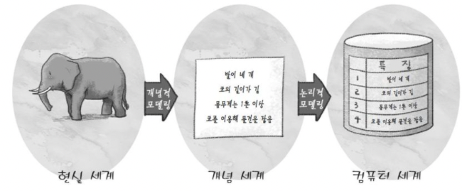

일반적으로 개념적 모델링과 논리적 모델링을 명확히 구분하지는 않고 합쳐서 데이터 모델링이라 부른다.

### 데이터모델

데이터 모델링을 쉽게 할 수 있도록 도와주는 도구를 `데이터 모델` 이라고 한다.

[ **개념적 데이터 모델과 논리적 데이터 모델 ]**

- 개념적 데이터 모델은 사람의 머리로 이해할 수 있도록 현실 세계를 개념적 모델링하여 데이터베이스의 개념적 구조로 표현하는 도구다.
- 논리적 데이터 모델은 개념적 구조를 논리적 모델링하여 데이터베이스의 논리적 구조로 표현하는 도구다.

데이터 모델은 `데이터 구조`, `연산`, `제약조건`으로 구성된다.

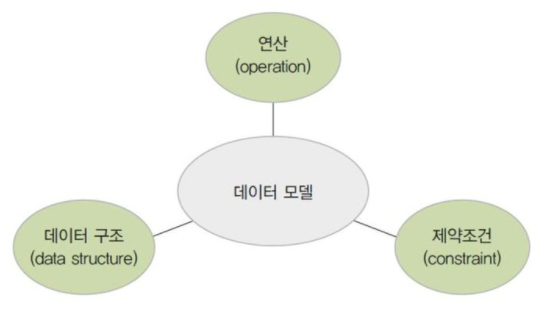

- **개념적 데이터 모델**
    - 데이터 구조는 현실 세계를 개념 세계로 추상화 했을 때 어떤 요소로 이루어져 읏는지를 표현하는 개념적 구조다.
- **논리적 데이터 모델**
    - 데이터 구조는 데이터를 어떤 모습으로 저장할 것인지를 표현한 논리적 구조다.
- **연산**
    - 데이터 구조에 따라 개념 세계나 컴퓨터 세계에서 실제로 표현된 값들을 처리하는 작업으로, 값이 연산에 의해 계속 변경될 수 있으므로 동적이라는 특징이 있다.
- **제약조건**
    - 구조적 측면의 제약 사항과 연산을 적용하는 경우 허용할 수 있는 의미적 측면의 제약사항이 있다.
    

**[ 예시 ]**

- 사람들의 요구 사항을 반영하는 설계도를 그리는 과정이 `개념적 데이터 모델링`
- 설계도를 그릴 때 사용하는 방법이나 도구가 `개념적 데이터 모델`

- 설계도를 토대로 모델하우스를 만드는 과정을 `논리적 데이터 모델링`
- 모델하우스를 만들 때 사용하는 방법이나 도구를 `논리적 데이터 모델`

## 02 개체-관계 모델

개체-관계 모델은 피터 첸이 1976년에 제안한 것으로, 개체와 개체 간의 관계를 이용해 현실 세계를 개념적 구조로 표현하는 방법이다. 개체-관계 모델을 이용해 개념적으로 모델링하여 그림으로 표현한 것을 개체-관계 다이어그램 또는 E-R 다이어그램이라 한다.

### 개체

- 개체는 현실 사람이나 사물, 학과, 과목과 같이 구별되는 모든 것을 의미한다. (객체라고 생각하면 됨)
- 개체는 다른 개체와 구별되는 이름을 가지고, 고유한 특성이나  상태, 즉 속성을 하나 이상 가지고 있다.

### 개체타입

- 개체를 고유의 이름과 속성들로 정의한 것
- 파일 구조의 레코드 타입에 대응됨

### 개체 인스턴스

- 개체를 구성하고 있는 속성이 실제 값을 가짐으로써 실체화된 개체
- 개체 어커런스라고도 함
- 파일 구조의 레코드 인스턴스에 대응 됨

### 개체 집합

- 특정 개체 타입에 대한 개체 인스턴스들을 모아놓은 것

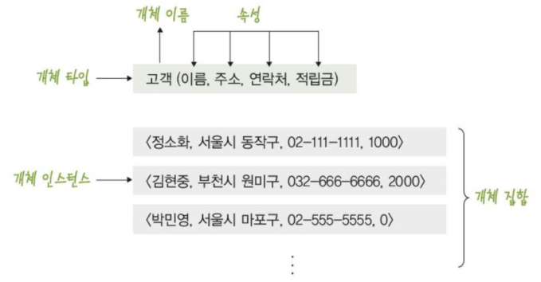

> E-R 다이어그램에서는 개체를 사각형으로 표현하고 사각형 안에 개체의 이름을 표기한다.
>

### 속성

- 개체나 관계가 가지고 있는 고유의 특성
- 의미 있는 데이터의 가장 작은 논리적 단위
- 파일 구조의 필드와 대응됨

> E-R 다이어그램에서는 속성을 타원으로 표현하고 타원 안에 이름을 표기
>

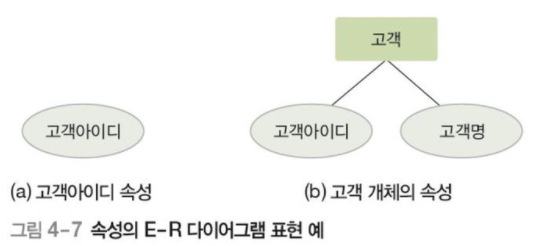

### 속성의 분류

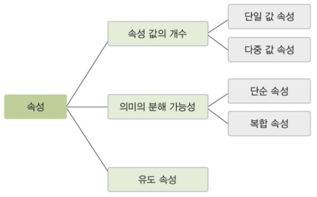

### 단일 값 속성과 다중 값 속성

- 특정 개체를 구성하는 속성의 값이 하나면 `단일 값 속성`이다.
    - ex) 고객 개체를 구성하는 이름, 적립금 등의 속성은 한 명의 고객 인스턴스에 대해 하나의 값만 가진다.

- 여러개의 값을 가질 수 있으면 `다중 값 속성`이다.
    - ex) 고객 개체를 구성하는 연락처 속성은 한 명의 고객 인스턴스에 대해 집전화, 휴대전화 등 여러개를 가질 수 있다.
    

> 다중값 속성은 E-R 다이어그램에서 이중 타원으로 표현한다.
>

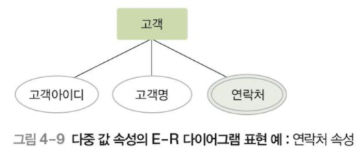

### 단순 속성과 복합 속성

- 단순 속성은 의미를 더는 분해할 수 없는 속성이다. 즉 단순 속성의 값은 의미가 하나다.
    - ex) 책 개체의 이름, ISBN, 가격

- 복합속성은 의미를 분해할 수 있어 값이 여러 개의 의미를 포함한다.
    - ex) 고객 개체를 구성하는 주소 속성 도, 시, 동, 우편번호 등의 의미로 세분화 할 수 있다.

> 복합 속성은 E-R 다이어그램에서 아래와 같이 표현한다.
>

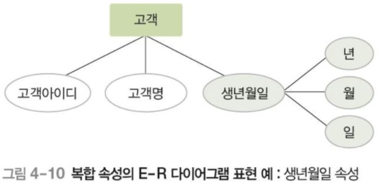

### 유도 속성

- 기존의 다른 속성 값에서 유도되어 결정되는 속성
- 값이 별도로 저장 되지 않음
    - ex) 책 개체의 가격과 할인율 속성으로 계산되는 판매가격, 고객 개체의 출생연도 속성으로 계산 되는 나이

> E-R 다이어그램에서 점선 타원으로 표현
>

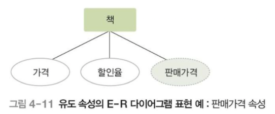

### 널 속성

- 널 값이 허용되는 속성

### 널 값

- 아직 결정되지 않거나 모르는 값 또는 존재하지 않는 값
- 공백이나 0과는 의미가 다름
    - ex) 등급 속성이 널 값 → 등급이 아직 결정되지 않았음을 의미

### 키 속성

- 각 개체 인스턴스를 식별하는 데 사용되는 속성
- 모든 개체 인스턴스의 키 속성 값이 다름
- 둘  이상의 속성들로 구성되기도 함
    - ex) 고객아이디 속성이 없는 경우 고객명과 집전화번호 속성을 조합하여 키를 구성할 수 있음

> E-R 다이어그램에서 밑줄로 표현
>

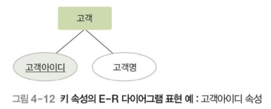

### 관계

- 개체와 개체가 맺고 있는 의미 있는 연관성
- 개체 집합들 사이의 대응 관계, 매핑을 의미한다.
    - Ex ) 고객 개체와 책 개체 간의 구매 관계 → “고객은 책을 구매한다”

> E-R 다이어그램에서 마름모로 표현
>

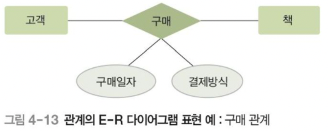

### 관계의 유형

- 이항 관계 : 개체 타입 두개가 맺는 관계
- 삼항 관계 : 개체 타입 세개가 맺는 관계
- 순환관계 : 개체 타입 하나가 자기 자신과 맺는 관계

**[ 관계의 분류 기준 카디널리티 ]**

관계를 맺는 두 개체 집합에서, 각 개체 인스턴스가 연관성을 맺고 있는 상대 개체 집합의 인스턴스 개수

**[ 일대일 1:1 관계 ]**

개체 A의 각 개체 인스턴스가 개체 B의 개체 인스턴스 하나와 관계를 맺을 수 있고, 개체 B의 각 개체 인스턴스도 개체 A의 개체 인스턴스 하나와 관계를 맺을 수 있음

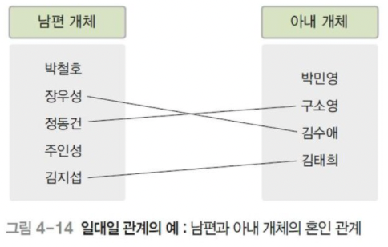

**[ 일대다 1:n 관계 ]** 

개체 A의 각 개체 인스턴스가 개체 B의 개체 인스턴스 여러개와 관계를 맺을 수 있지만, 개체 B의 각 개체 인스턴스도 개체 A의 개체 인스턴스 하나와 관계를 맺을 수 있음

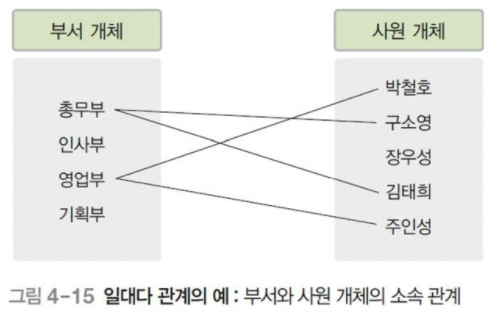

**[ 일대다 n:m 관계 ]** 

개체 A의 각 개체 인스턴스가 개체 B의 개체 인스턴스 여러개와 관계를 맺을 수 있고, 개체 B의 각 개체 인스턴스도 개체 A의 개체 인스턴스 여러개와 관계를 맺을 수 있음

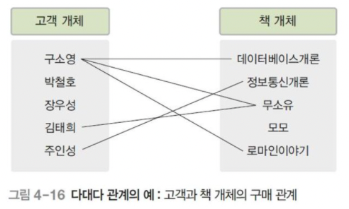

### 관계의 참여 특성

**[ 필수적 참여 (전체 참여) ]**

- 모든 개체 인스턴스가 관계에 반드시 참여해야 하는 것을 의미
    - Ex) 모든 고객이 책을 구매해야 한다고 가정했을 때 모든 고객은 책을 반드시 구매해야 함

**[ 선택적 참여 (부분 참여) ]**

- 개체 인스턴스 중 일부만 관계에 참여해도 되는 것을 의미
    - Ex) 고객이 구매하지 않은 책이 존재할 수 있음

> E-R 다이어그램에서 이중선으로 표현
>

### 관계의 종속성

- 약한 개체
    - 다른 개체의 존재 여부에 의존적인 개체
- 오너 개체
    - 다른 개체의 존재 여부를 결정하는 개체

Ex)학생 개체와 학부모 개체 예시에서 학생이 졸업하면 학부모 데이터도 함께 삭제된다. 학생 개체가 오너 개체

- 오너개체와 약한 개체는 일반적으로 일대다의 관계를 가지고, 약한 개체는 오너 개체와의 관계에 필수적으로 참여하는 특징이 있음.
- 약한 개체는 오너 개체의 키를 포함하여 키를 구성하는 특정이 있음

> E-R 다이어그램에서 약한 개체는 이중 사각형으로 표현하고 약한 개체가 오너 개체와 맺는 관계는 이중 마름모로 표현
>

### 개체-관계 다이어그램

- 사각형 : 개체를 표현
- 마름모 : 관계를 표현
- 타원 : 속성을 표현
- 링크 : 각 요소를 연결
- 레이블 : 일대일, 일대다, 다대다 관계를 표기

## 논리적 데이터 모델

### 논리적 데이터 모델의 개념과 특성

- E-R다이어그램으로 표현된 개념적 구조를 데이터베이스에 저장할 형태로 표현한 논리적 구조를 논리적 데이터 모델이라 한다.
    - 데이터베이스의 논리적 구조 = 데이터베이스 스키마
- 사용자가 생각하는 데이터베이스의 모습 또는 구조
- 관계 데이터 모델, 계층 데이터 모델, 네트워크 모델 등이 있음

### 계층 데이터 모델

- 데이터베이스의 논리적 구조가 트리 형태
- 루트 역할을 하는 개체가 존재하고 사이클이 존재하지 않음
- 개체 간에 상하 관계가 성립
    - 부모 개체 / 자식 개체
    - 부모와 자식 개체는 일대다 관계만 허용됨
- 두 개체 사이에 하나의 관계만 정의할 수 있음
- 다대다 관계를 직접 표현할 수 없음
- 개념적 구조를 모델링하기 어려워 구조가 복잡해질 수 있음
- 데이터의 삽입, 수정, 삭제, 검색이 쉽지 않음

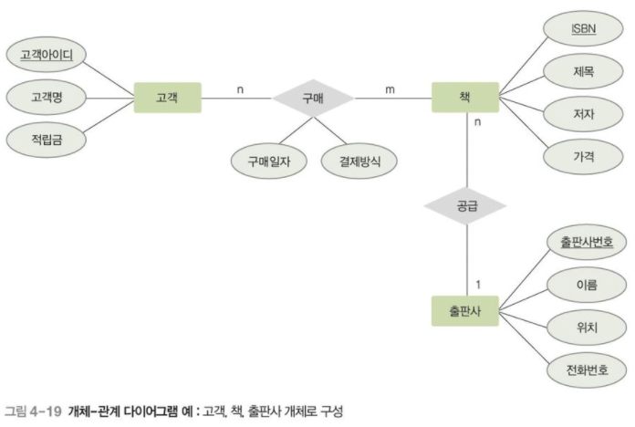

### 네트워크 데이터 모델

- 데이터베이스의 논리적 구조가 네트워크 또는 그래프 형태임
- 개체 간에는 일대다 관계만 허용됨
    - 오너 / 멤버
- 두 개체 사이에 여러 관계를 정의할 수 있어 이름으로 구별함
- 다대다 관계를 직접 표현할 수 없음
- 구조가 복잡하고 데이터의 삽입, 삭제, 수정, 검색이 쉽지 않음

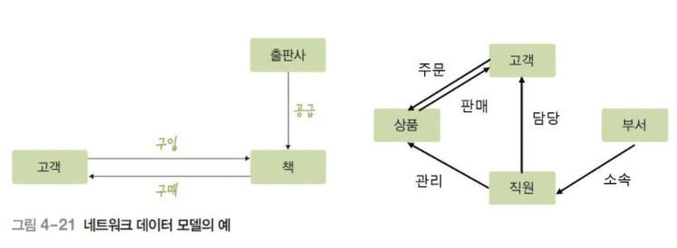
