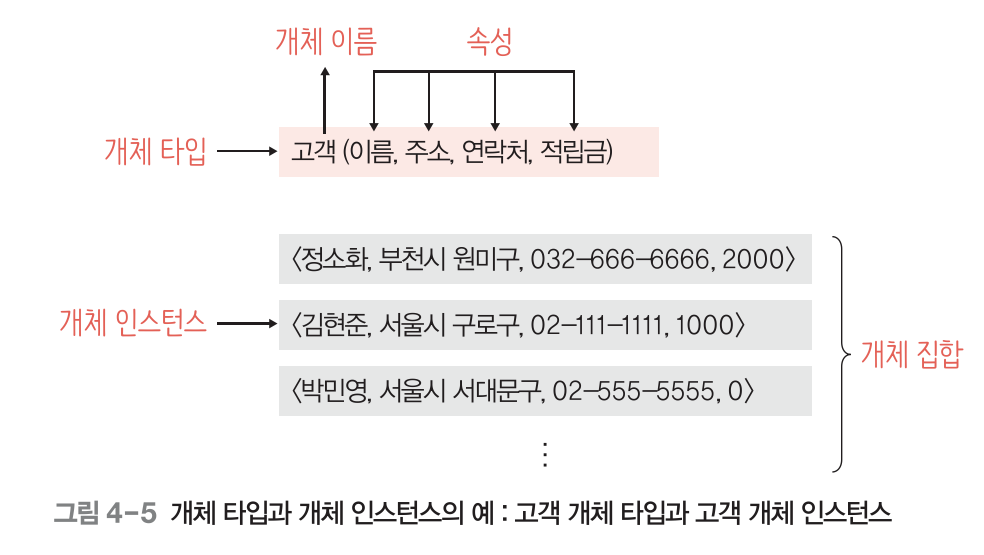
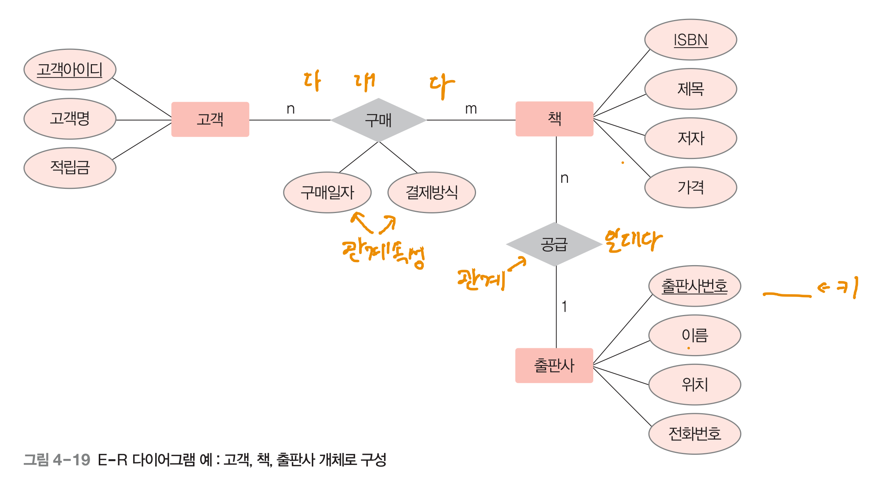

## ch04 데이터 모델링

### 1. 데이터 모델링과 데이터 모델의 개념
 

 

현실 세계에 존재하는 데이터를 컴퓨터 세계의 데이터베이스로 옮기는 변환 과정을 데이터 모델링이라 한다. 이때 데이터베이스에 저장하여 관리할 만한 가치가 있는 중요 데이터만 찾아내어 변환해야 하는데, 이런 작업을 **추상화**라 한다.

현실 세계에서 특정 객체의 중요 데이터를 추출하여 개념 세계로 옮기는 작업을 **개념적 모델링**이라 한다.
개념 세계의 데이터를 데이터베이스에 저장할 구조를 결정하고 이 구조로 표현하는 작업을 **논리적 모델링**이라 한다.

그리고 이런 데이터 모델링을 쉽게 할 수 있도록 도와주는 게 **데이터 모델(모델링 도구)**이다. 데이터 모델은 데이터 모델링의 결과물을 표현하는 도구로, **개념적 데이터 모델**과, **논리적 데이터 모델**이 있다.

데이터 모델은 **데이터 구조**, 연산, 제약조건으로 구성된다.

개념적 데이터 모델의 데이터 구조 : 현실 세계를 개념 세계로 추상화했을 때 **어떤 요소로 이루어져있는지**를 표현.
논리적 데이터 모델의 데이터 구조 : 데이터를 **어떤 모습으로 저장할 것인지** 표현.

개념적 데이터 모델링과 논리적 데이터 모델링 작업을 통틀어 데이터베이스 설계라고 한다.

개념적 데이터 모델중 대표적으로 많이 사용하는 게 **개체-관계 모델(E-R 모델)**이고,
논리 데이터 모델에는 **관계 데이터 모델**이 있다.

---

### 2. 개체-관계 모델

현실 세계를 개체-관계 모델을 이용해 개념적으로 모델링하여 그림으로 표현한 것을 개체-관계 다이어그램이라 한다.

 

#### 1) 개체

사람, 사물과 같이 현실 세계에서 구별되는 (저장할 만한 가치가 있는 중요 데이터를 가진) 모든 것으로서 개념적 모델링의 가장 중요한 요소이다.

물리적인 존재인지는 따지지 않는다.

개체는 다른 개체와 구별되는 고유한 특성이나 상태, 속성을 하나 이상 가지고 있다.

개체를 고유한 이름과 속성들로 정의한 것 → 개체 타입

개체가 실체화된 것→ 개체 인스턴스(= 어커런스)

 

#### 2) 속성

개체가 가지고 있는 고유의 특성.

의미있는 데이터의 가장 작은 논리적 단위.

속성 자체로는 의미가 없으나 관련 속성을 모아 개체를 구성하면 중요한 의미를 표현할 수 있다.

ex) 나이 / 지역 / .. < -개별  —> 93년 순천 → 속성이 모여 의미를 가짐.

 

#### 2-1) 단일 값 속성과 다중 값 속성

단일 값 속성 - 속성의 값이 하나. ex) 이름 속성

다중 값 속성 - 속성 값이 여러 개 가능. ex) 연락처 속성

 

#### 2-2) 단순 속성과 복합 속성

단순 속성 - 의미를 더는 분해할 수 없는 속성. ex) 고객 개체의 적립금 속성.

복합 속성 - 의미를 분해할 수 있어 값이 여러 개의 의미를 포함. ex) 주소 → 도 / 시 / 동 / ...

 

#### 2-3) 유도 속성

속성 값을 별도로 저장하지 않고 기존의 다른 속성 값에서 유도되어 결정되는 속성.
ex) 가격 X 할인율 ⇒ 판매가격(유도속성)

 

#### 2-4) 널 속성

아직 결정되지 않았거나 모르는 값. 존재하지 않는 값.  ≠ 공백 혹은 0

널 속성 : 널 값이 허용되는 속성. ex) 취미 속성이 널 값 → 고객이 취미를 입력하지 않았음을 의미.

 

#### 2-5) 키 속성

개체 집합에서 각 개체 인스턴스를 식별하는 속성.

**키를 둘 이상의 속성으로 구성할 수 있다(복합키!)**. ex) 고객명 + 집전화번호

 

#### 3) 관계

개체와 개체가 맺고 있는 의미 있는 연관성. 개체 집합들 사이의 대응관계, 즉 매핑을 의미.

관계도 개체처럼 속성을 가질 수 있다.

 

#### 3-1) 관계의 유형

(1) 관계에 참여하는 개체 타입 수를 기준으로 - 이항 관계, 삼항관계, 순환 관계

(2) 매핑 카디널리티를 기준으로 - 일대일, 일대다, 다대다

매핑 카디널리티란? 두 ‘개체 집합’에서 각 개체 인스턴스가 연관성을 맺고 있는 상대 개체 집합의 인스턴스 개수

 

#### 3-2) 관계의 참여 특성

개체A와 B 사이의 관계에서, 개체 A의 모든 개체 인스턴스가 관계에 반드시 참여해야 된다면 개체 A가 관계에 ‘필수적 참여한다’ 또는 ‘전제 참여한다’고 한다.

인스턴스 중 일부만 관계에 참여해도 되면 ‘선택적/부분 참여 한다’고 한다.

선택 참여인지 되는지, 필수 참여인지는 디비 설계 과정에서 중요한 사항이다 → 개체 인스턴스 삽입, 삭제, 변경시의 제약 사항이 되므로.

 

#### 3-3) 관계의 종속성

- 개체 A의 존재가 개체 B의 존재 여부에 의존적이면 개체 A가 개체 B에 종속되어 있다고 한다 → 존재 종속.
- 존재 여부 결정 → 강한 개체(오너 개체)
  존재 여부에 의존적 → 약한 개체(종속 개체)
  ex) 회사 직원의 부양가족 데이터 → 직원이 퇴사하면 부양가족 데이터도 사라짐
  ⇒ 직원 - 강한 개체 / 부양가족 - 약한 개체
- 약한 개체는 강한 개체와의 관계에 필수적 참여
- 약한 개체는 보통 강한 개체의 키를 포함하여 키를 구성
  ex) **부양 가족 개체의 키 → 직원번호 속성 + 부양가족 이름 속성**
  ⇒ 부양 가족의 이름 속성 → 구별자 or 부분키라고 한다.

 

#### 4) E-R 다이어그램

(개념적 데이터 모델 중 하나인) 개체-관계 모델을 이용해 현실 세계를 개념적으로 모델링한 결과물.

**관계 속성인 구매** **속성 하나가 하나의 테이블로서 존재한다.**

개체 → 사각형

속성 → 타원

다중 값 속성 → 이중 타원

복합 속성 → 타원에 가지 치고 타원들이 또 달려있음

유도 속성 → 점선 타원

키 속성 → 타원 안 속성 명에 밑줄

관계 → 마름모

필수적 참여 관계 → 이중선

약한 개체와 강한 개체의 관계 → 이중 마름모

약한 개체 → 이중 사각형

---

### 3. 논리적 데이터 모델

사용자 입장에서 E-R 다이어그램으로 표현된 **개념적 구조를 데이터베이스에 저장할 형태로 표현한 논리적인 구조**를 논리적 데이터 모델이라 한다.

논리적 데이터 모델은 논리적 데이터 모델링의 결과물이고, **사용자가 생각하는 데이터베이스의 모습 또는 구조**다.

논리적 데이터 모델로 표현된 데이터베이스의 논리적 구조가 데이터베이스 스키마다.

일반적으로 많이 사용되는 논리적 데이터 모델로 **관계 데이터 모델(2차원 테이블 형태)**을 사용한다.

 

#### 2) 계층 데이터 모델

계층 데이터 모델은 데이터베이스의 논리적 구조를 트리 형태로 표현한다.

루트 역할을 하는 개체가 존재하고, 사이클은 존재하지 않는다.

상위에 있는 개체를 부모 개체, 하위에 있는 개체를 자식 개체라 하고, 이들 간에는 상하 관계가 성립한다.

모든 자식 개체는 부모 개체를 하나만 가질 수 있다.

 

#### 3) 네트워크 데이터 모델

데이터 베이스의 논리적 구조가 그래프 또는 네트워크 형태로 표현된다.
