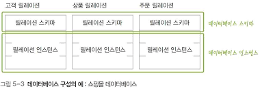

# 05 관계 데이터 모델

# 01 관계 데이터 모델의 개념

## 1. 관계 데이터 모델의 기본 용어

관계 데이터 모델에서는 하나의 개체에 관한 데이터를 릴레이션에 담아 데이터베이스에 저장한다.

### 릴레이션

> 테이블이 더 큰 개념. 모든 릴레이션은 테이블이지만 모든 테이블은 릴레이션이 아니다. [참고](https://5dol.tistory.com/17)
> 

개체에 관한 데이터를 2차원 테이블의 구조로 정의한 것

### 속성

릴레이션의 열을 속성이라고 부른다.

### 투플

릴레이션의 행을 투플이라 부른다.

### 도메인

속성의 특성을 고려한 데이터 타입으로 정의한다. ( 도메인 = 데이터 타입 )

### 널 값

데이터베이스 시스템 마다 표시하는 기호가 다르다. ( 보통 공백을 사용 )

### 차수

릴레이션에서 속성의 전체 개수를 차수라고 한다.

### 카디널리티

릴레이션에서 투플의 전체 개수를 카디널리티라고 한다.

## 2. 릴레이션과 데이터베이스의 구성

관계 데이터 모델에서 릴레이션은 릴레이션 스키마와 릴레이션 인스턴스로 구성된다.

### 릴레이션 스키마

릴레이션의 이름, 릴레이션의 속성들로 정의하는 릴레이션의 논리적 구조다.

### 릴레이션 인스턴스

어느 한 시점에 존재하는 투플들의 집합이다.

### 데이터베이스 스키마와 데이터베이스 인스턴스

특정 데이터베이스 스키마를 설계한다는 것은 필요한 모든 릴레이션의 스키마를 모두 정의한다는 뜻.

## 3. 릴레이션의 특성

- 투플의 유일성 : 하나의 릴레이션에는 동일한 투플이 존재할 수 없다. ( 식별자로 구분 해야 함 )
- 투플의 무순서 : 하나의 릴레이션에서 투플 사이의 순서는 무의미하다.
- 속성의 무순서 : 하나의 릴레이션에서 속성 사이의 순서는 무의미하다.
- 속성의 원자성 : 속성 값으로 원자 값만 사용할 수 있다. ( 하나의 값(속성)만 가질 수 있음 )

## 4. 키의 종류

## 슈퍼키

- 유일성의 특성을 만족하는 속성 또는 속성들의 집합이다.
- 하나의 릴레이션에서 키로 지정된 속성 값은 투플마다 달라야 한다.
- 즉, 키 값이 같은 투플은 존재할 수 없다.
- *유일성: 키로 지정된 속성 값은 투플마다 달라야 한다.*

## 후보키

- 유일성과 최소성을 만족하는 속성 또는 속성들의 집합이다.
- (고객아이디 O ) , (고객주소, 고객이름 O )   ( 고객아이디, 고객이름 X)
- *최소성 : 꼭 필요한 최소한의 속성들로만 키를 구성해야 한다.*

## 기본키

- 후보키 중에서 기본적으로 사용할 키

### 기본키 선택 기준

- 널 값을 가질 수 있는 속성이 포함된 후보키는 기본키로 부적합하다.
- 값이 자주 변경될 수 있는 속성이 포함된 후보키는 기본키로 부적합하다.
- 단순한 후보키를 기본키로 선택한다.

## 대체 키

기본키로 선택되지 못한 후보키  // 어디에 쓰이는 거지 ?

## 외래키

- 다른 릴레이션의 기본키를 그대로 참조하는 속성의 집합이 외래키
- 외래키 자신이 속한 릴레이션의 기본키를 참조하도록 외래키를 정의할 수도 있다.

# 02 관계 데이터 모델의 제약

- 관계 데이터 모델에서 정의하고 있는 기본 제약 사항은 키와 관련한 무결성 제약조건이다.
- 무결성은 데이터에 결함이 없는 상태, 즉 데이터가 정확하고 유표하게 유지된 상태를 말한다.
- 제약조건의 주요 목적은 저장된 데이터의 무결성을 보장하고, 데이터의 상태를 일관되게 유지하는 것이다.

### 무결성 제약조건

- 개체 무결성 제약조건 : 기본키를 구성하는 모든 속성은 널 값을 가질 수 없다.
- 참조 무결성 제약조건 : 외래키는 참조할 수 없는 값을 가질 수 없다.
    - 즉, 없는걸 참조할 수 없다.
    - 하지만 외래키 자신이 널 값일 수는 있다.
