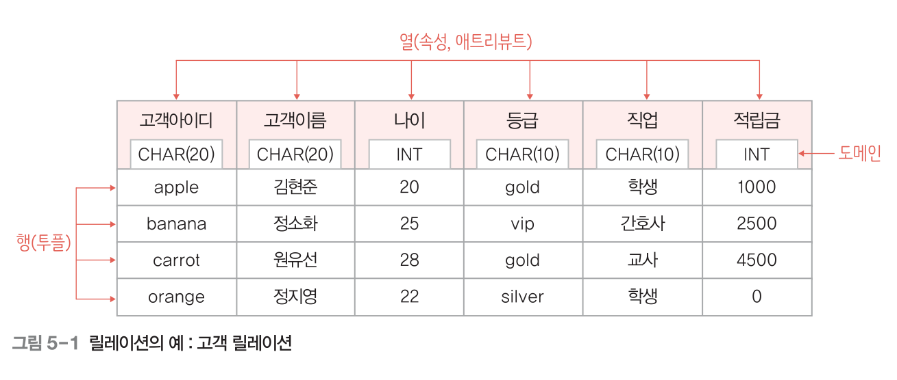
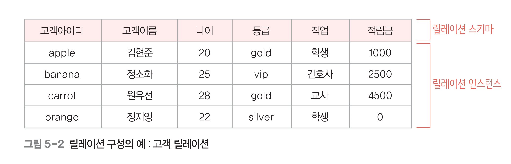
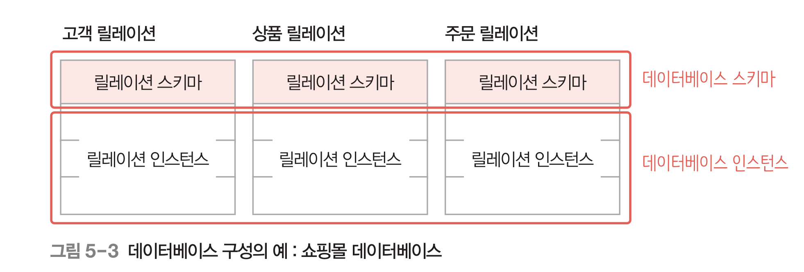
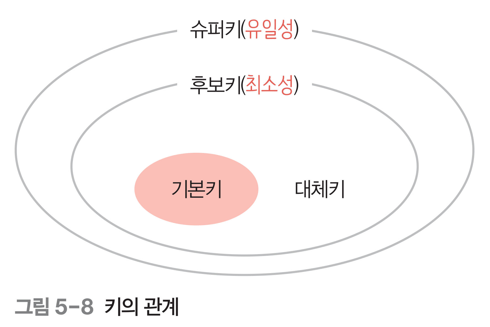
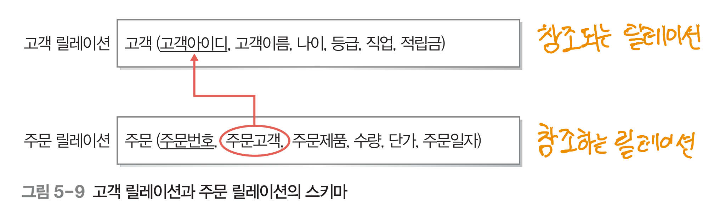
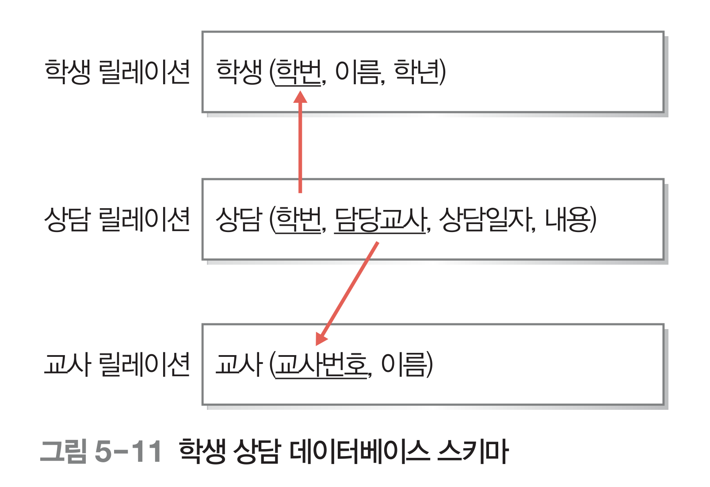
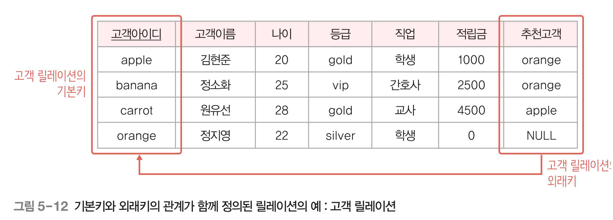
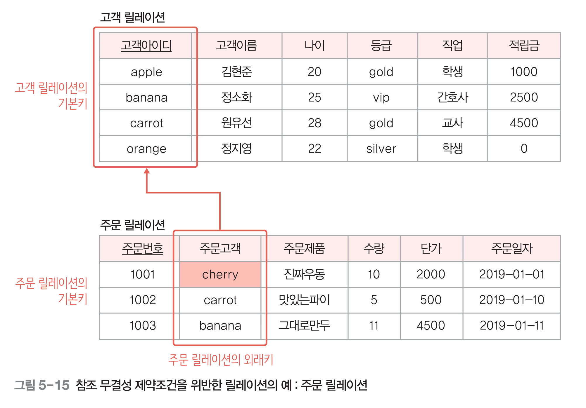
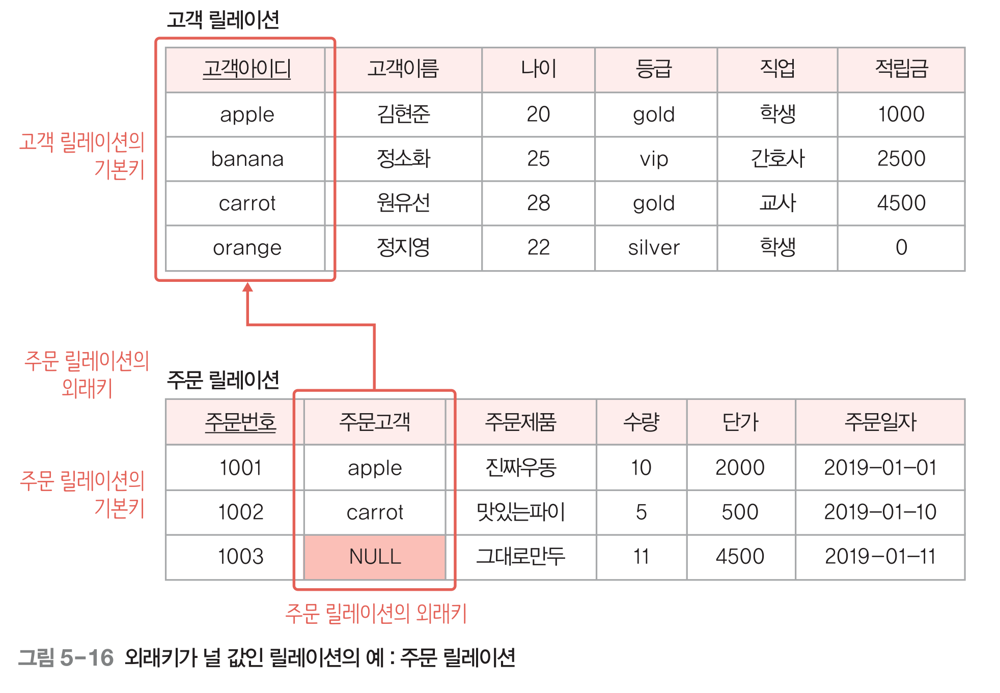

## ch05 관계 데이터 모델

ch04의 논리 데이터 모델(개념세계 → 디비에 저장할 물리적 세계로 모델링 할 때 쓰는 모델링 도구) 중 빈번하게 쓰이는 게 관계 데이터 모델.

관계 데이터 모델의 핵심 → **릴레이션**

릴레이션은 하나의 테이블을 의미하고, 테이블의 스키마만을 얘기하는 것이 아니고 테이블의 스키마와, 저장된 모든 인스턴스를 포함한 것.

 

## 1. 관계 데이터 모델의 개념

### 1) 관계 데이터 모델의 기본 용어

관계 데이터 모델에서는 하나의 개체에 관한 데이터를 릴레이션 하나에 담아 데이터베이스에 저장한다.

 

#### 1-1) 속성(어트리뷰트)

릴레이션의 열. 파일의 필드에 대응하는 개념.

 

#### 1-2) 튜플

속성들의 값을 모아놓은 것. 개체의 인스턴스이다. 파일의 레코드에 대응.

 

#### 1-3) 도메인

ex) `CHAR(20)`, `INT`...

속성 하나가 가질 수 있는 모든 값의 집합.

ex) 도메인이 `INT` → -21억 ~ 21억 내의 어떠한 값이든 들어갈 수 있음(=가능한 모든 값의 집합).

속성 값으로는 더는 분해할 수 없는 원자 값만 사용할 수 있음.

속성과 데이터의 관계를 프로그래밍 언어에 비유해서 바라보자면, 속성은 변수, 도메인은  데이터 타입으로 생각할 수 있다.

 

#### 1-4) NULL 값

릴레이션에 있는 특정 튜플의 속성 값을 모르거나, 적합한 값이 없는 경우 Null 값을 사용.

 

#### 1-5) 차수(Degree)

하나의 릴레이션에서 속성의 전체 개수를 릴레이션의 차수라고 한다.

위의 고객 개체 그림에서는 속성 값이 6개 있으므로 차수가 6이다.

 

#### 1-6) 카디널리티

릴레이션의 전체 투플 개수를 의미 `==` 디비에 저장되어 있는 개체 인스턴스의 개수

 

### 2) 릴레이션과 데이터베이스의 구성

릴레이션은 릴레이션 스키마와 릴레이션 인스턴스로 구성.

스키마는 속성과 도메인에 대한 것.

인스턴스는 튜플들.

 

#### 2-1) 릴레이션 스키마

릴레이션의 이름과 릴레이션에 포함된 모든 속성의 이름으로 정의하는 릴레이션의 논리적 구조.

`릴레이션이름(속성이름1, 속성이름2, ..., 속성이름n)` 과 같은 형태로 나타낸다.

→ 릴레이션이름을 테이블명이라고 생각하면 결국 개체 하나하나가 테이블을 구성하는 것.

‼️모든 릴레이션은 테이블이지만, 모든 테이블이 릴레이션은 아니다(노리)
→ 개체간 관계가 있을 때 관계를 이루는 개체 테이블이 릴레이션이 되는 건가?

 

#### 2-2) 릴레이션 인스턴스

릴레이션에 존재하는 튜플들의 집합. 각 속성들에 대응하는 실제 값으로 구성되어 있다.

DML로 CRUD할 때 조작되는 데이터들이 릴레이션 인스턴스이다.

 

#### 2-3) 데이터베이스 스키마와 데이터베이스 인스턴스

데이터베이스는 여러 릴레이션으로 구성된다.

데이터베이스의 전체 구조를 의미하는 데이터베이스 스키마는 데이터베이스를 구성하는 릴레이션들의 스키마를 모아놓은 것이다.

즉 데이터베이스 스키마를 설계한다 `==` 모든 릴레이션의 스키마를 설계한다.

 

### 3) 릴레이션의 네 가지 특징

#### (1) 튜플의 유일성 : 하나의 릴레이션에는 동일한 튜플이 존재할 수 없다.

중복 불가 → 어떻게 구별 및 중복 방지? → Key를 이용

#### (2) 튜플의 무순서 : 하나의 릴레이션에서 튜플 사이의 순서는 무의미하다.

무의미 하다.

#### (3) 속성의 무순서 : 하나의 릴레이션에서 속성간의 순서는 무의미하다.

무의미 하다.

#### (4) 속성의 원자성 : 속성 값으로 원자 값만 사용할 수 있다.

모든 속성 값은 더는 분해할 수 없는 하나의 값, 즉 원자 값만 가질 수 있다.

즉 다중 값을 가질 수 없다.

❗️속성이 여러개의 속성으로 구성될 수 있는 다중 속성과는 다른 얘기. 다중 속성의 각 속성들도 (속성) 값은 원자 값만 가질 수 있다.

 

### **4) 키의 종류**

튜플들을 유일하게 구별해주는 역할은 속성 또는 속성들의 집합인 키가 담당한다.

관계 데이터 모델에서는 다섯 가지 키를 사용한다.

 

#### 4-1) 슈퍼키

유일성의 특성을 만족하는 속성 또는 속성들의 집합.

**유일성**은 슈퍼키가 갖추어야 하는 기본 특성 → 하나의 릴레이션에서 **키로 지정된 속성 값이 튜플마다 달라야 한다**는 것 → 키 값이 같은 튜플은 존재할 수 없음.

 

#### 4-2) 후보키

**유일성**과 **최소성**을 만족하는 속성 또는 속성들의 집합. **최소성은 꼭 필요한 최소한의 속성들로만 키를 구성하는 것.**

→ 슈퍼키 중에서 최소성을 만족하면 후보키

 

#### 4-3) 기본키(Primary key)

튜플을 구별하기 위해 여러 개의 후보키 모두 사용할 필요는 없으니 **여러 후보키 중에서 기본적으로 사용할 키를 선택해야 하는데, 이것이 기본키**이다 → 기본키가 단일 속성이 아닐 수도 있음!

기본키를 선택할 때 고려할 기준

- 널 값을 가질 수 있는 속성이 포함된 후보키는 기본키로 부적합하다.
  → 튜플들을 구분해주는 속성이니 값이 있어야 제 역할을 함
- 값이 자주 변경될 수 있는 속성이 포함된 후보키는 기본키로 부적합하다.
  → 값이 바뀔 때마다 기본키 값으로 적합한지 판단해야 하기 번거롭기 때문.
  이 말은 아마 외래키 예시에서 볼 수 있듯이 기본키를 참조하는 릴레이션도 있고 해서 참조하고 있는 테이블의 참조 무결성 체크를 해줘야 하고.. 그런 것 때문이 아닐까?
- 단순한 후보키를 기본키로 선택한다.
  → 자릿수가 적은 정수, 단순 문자열, 구성하는 속성 개수가 적은 후보키 등.

 

#### 4-4) 대체키

기본키로 선택되지 못한 후보키들.

 

#### 4-5) 외래키(foreign key)

어떤 릴레이션의 속성 또는 속성 집합이 다른 릴레이션의 기본키인 속성이 외래키가 된다.

즉 다른 릴레이션의 기본키를 그대로 참조하는 속성의 집합이 외래키.

위 그림처럼 주문 릴레이션의 주문고객 속성이 고객 릴레이션의 기본키인 고객아이디 속성을 참조하고 있을 때 주문 릴레이션의 주문고객 속성은 주문 릴레이션의 외래키가 된다.

참조하는 릴레이션의 외래키 속성은 참조되는 릴레이션의 기본키 속성과 도메인이 반드시 같아야 한다. 그래야 비교 연산이 가능하기 때문.

만약 외래키가 기본키를 참조하지 않고 고객이름, 나이같은 다른 속성을 참조한다고 하면, 속성 값이 유니크하지 않기 때문에 주문 릴레이션이 어떤 고객의 튜플을 참조해야 할지 몰라 정확한 검색을 하지 못할 것이다.

하나의 릴레이션이 여러 외래키를 가지고 있을 수 있다.

상담 릴레이션이 학생 릴레이션의 기본키와 교사 릴레이션의 기본키를 참조하고 있다.

그리고 외래키를 기본키로 사용할 수도 있고, 외래키를 포함하여 기본키를 구성할 수도 있다.

외래키가 다른 릴레이션의 기본키를 참조하는 것이 아니라 릴레이션 자기 자신을 참조하고 있을 수도 있다.  즉, 자기 자신의 기본키를 참조하여 외래키를 정의할 수 있다.

**게시판 셀프 대댓글 구현할 때 사용 가능**

외래키는 기본키를 참조하지만 기본키가 아니기 때문에 널 값을 가질 수 있다.
→ orange 고객의 추천고객은 없음

외래키는 기본키가 아니기 때문에 다른 튜플이 같은 값을 가질 수 있다.
→ apple고객과 banana고객의 추천 고객은 같음(orange)

 

### 2. 관계 데이터 모델의 제약

관계 데이터 모델에서 정의하고 있는 기본 제약 사항은 키와 관련한 **무결성 제약조건**이다.

무결성이란 데이터에 결함이 없는 상태, 즉 데이터가 정확하고 유효하게 유지된 상태를 의미.

무결성은 권한 있는 사용자의 잘못된 요구에 의해 데이터가 부정확해지지 않도록 보호하는 것(디비가 다 해준다~).

 

#### 2-1) 개체 무결성 제약 조건

기본키에는 널 값이 들어갈 수 없다는 규칙.

→ 새로운 튜플이 삽입되는 연산 or 기존 튜플의 기본키 속성 값을 변경하는 연산이 발생할 때 기본키에 NULL 값이 포함되어 있으면 연산을 거부하면 된다.

→ 근데 어차피 데이터베이스가 자동으로 수행하므로 우리가 신경쓸 필요 없다.

 

#### 2-2) 참조 무결성 제약조건

외래키는 참조할 수 없는 값을 가질 수 없다는 규칙.

고객 릴레이션에 존재하지 않는 cherry라는 고객의 주문을 만들어낼 수 없음.
단, 주문 릴레이션에 처음 데이터를 삽입할 때의 얘기임. 아래 그림을 보자.

‼️ 외래키 값이 NULL이라고 해서 꼭 참조 무결성 제약조건을 위반하는 것은 아니다.

위 사진에서 만약 고객 릴레이션에 grape라는 고객이 있었고 grape고객의 주문 번호가 1003이라고 할 때, 이후 grape고객이 회원 탈퇴를 할 경우,

1. 관련 릴레이션인 주문 릴레이션에 연관 데이터가 존재함을 이유로 grape튜플 삭제 연산을 거부하거나
2. 주문번호 1003번 튜플도 같이 삭제하거나
3. 1003번 주문의 주문고객 속성 값을 NULL이나 기본 값으로 지정하는 방법을 사용할 수 있다.

위 사진에서는 NULL값을 넣어주는 방법을 택한 것으로 보인다.

+  노리 예시 ⇒ 사원 테이블과 부서 테이블이 있을 때 부서 테이블의 기본키를 사원 테이블의 부서 속성이 참조하고 있을 때, 사원이 새로 들어왔는데 아직 부서를 배정받지 못한 경우 외래키인 부서 번호가 NULL일 수 있음.

아무튼 참조 무결성 제약조건을 위배하지 않도록 하려면 외래키에 넣어주려는 값이, 참조되는 릴레이션의 속성 값으로 존재하지 않는 값이 들어가지 않도록 연산을 거부하면 된다. 그리고 역시나 디비가 알아서 해준다.
