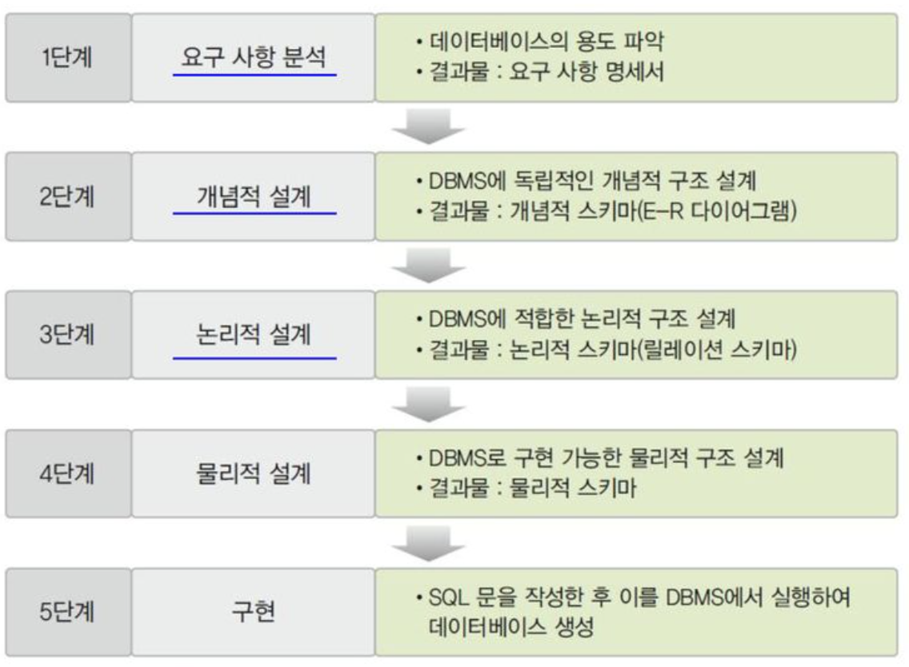
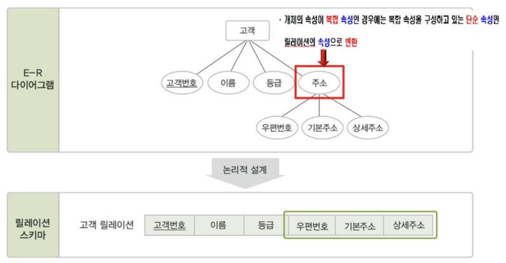
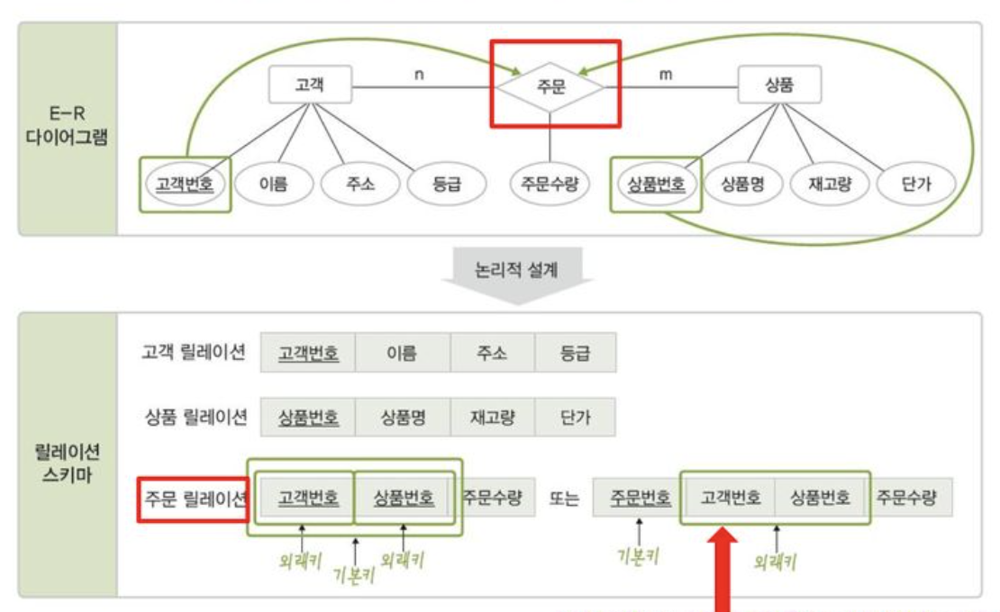
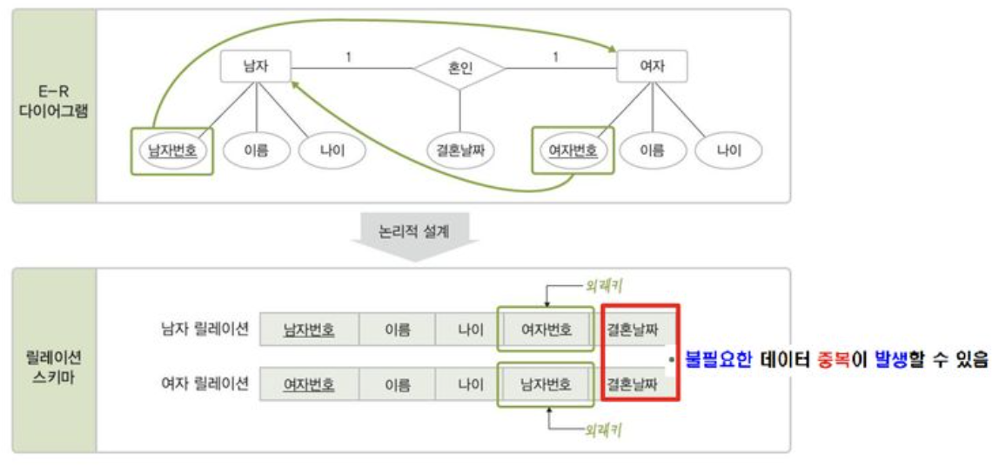
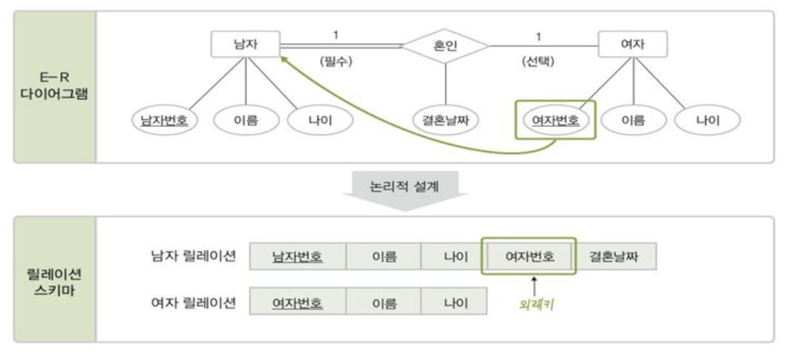
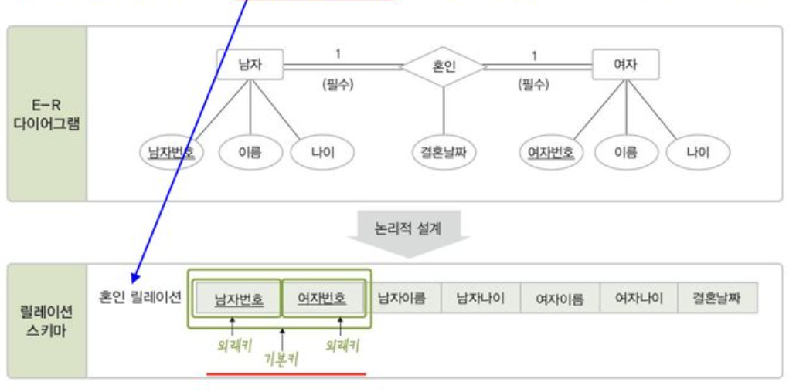
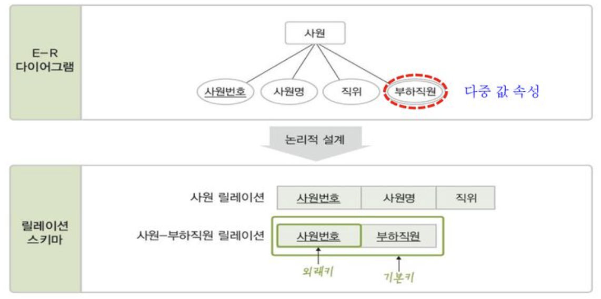

# 08 데이터베이스 설계

# 1. 데이터베이스 설계 단계

## 데이터베이스 설계의 과정

- 사용자의 다양한 요구 사항을 고려하여 데이터베이스를 생성하는 과정이다.
- E-R 모델과 변환규칙을 이용한 설계와 정규화를 이용한 설계가 있다.

## E-R 모델과 릴레이션 변환 규칙을 이용한 설계

### 1단계 : 요구사항 분석

- 데이터베이스의 **사용 용도를 파악**
- 필요한 데이터의 종류와 처리 방법 같은 요구사항을 수집
- 결과물 : 요구사항 명세서

### 2단계 : 개념적 설계

- 명세서를 바탕으로 사용자의 요구사항을 **E-R 다이어그램으로 표현한다**.
- DBMS에 독립적인 개념적 구조 설계
- 결과물 : 개념적 스키마 (E-R 다이어그램)

### 3단계 : 논리적 설계

- 개념적 설계 단계에서 생성한 개념적 구조를 기반으로 **논리적 구조를 설계한다.**
- DBMS에 종류에 따라 다양한 논리적 모델을 사용할 수 있지만, 일반적으로 관계 데이터 모델을 사용한다.
- DBMS에 적합한 논리적 구조 설계
- 결과물 : 논리적 스키마(릴레이션 스키마)

### 4단계 : 물리적 설계

- 저장 장치에 적합한 저장 레코드와 인덱스 구조 등을 설계하고, 탐색기법 등을 정의한다.
- DBMS에 구현 가능한 물리적 구조 설계
- 결과물 : 물리적 스키마

### 5단계 : 구현

- 설계 단계의 결과물을 기반으로 DBMS에서 SQL로 작성한 명령문을 실행하여 데이터베이스를 생성한다.

> 데이터베이스 설계의 모든 과정이 중요하지만, 특히 전체적인 데이터베이스의 개념적 구조와 논리적 구조를 설계하는 **요구사항 분석, 개념적 설계, 논리적 설계 단계가 핵심 단계다.**
> 

# 2. 요구사항 분석

- 요구사항 분석 전 데이터베이스를 사용할 주요 사용자의 범위를 결정한다.
- 사용자의 수행 업무를 분석한다. (업무와 관련한 필요 데이터가 무엇인지, 어떤 처리가 필요한지)
- 수집된 요구사항을 분석해 **명세서로 문서화한다.**

# 3. 개념적 설계

- 명세서를 바탕으로 개념적 데이터 모델을 이용하여 표현한다.
- `개체와 속성 추출` ⇒ `관계 추출` ⇒ `E-R다이어그램` 작성 순으로 개념적 모델링을 진행한다.

## 1. 개체와 속성 추출

- 제시된 요구 사항의 문장들에서 `명사`를 찾는다.
- 일반적이고 광범위한 의미의 명사는 제외한다.
- 사용자가 만족하는 데이터베이스를 개발하려면 요구사항 명세서의 문장을 빠짐없이 추출해야한다.

## 2. 관계 추출

- 일반적으로 관계는 요구사항을 표현한 문장에서 `동사`로 표현된다.
- 개체간의 연관성을 의미 있게 표현한 동사만 선택한다.
- *관계라는게 결국은 개체인 것인가? (개체일수도 아닐수도 있다.)*
    - *다대다 외의 관계를 릴레이션으로 변환해도 된다. (릴레이션이 많아져 복잡도 증가)*
- *선택적 참여, 필수적 참여 어디다 쓰려고?*

# 4. 논리적 설계

- 개념적 설계 단계에서 생성한 개념적 스키마를 기반으로 논리적 스키마를 설계한다.
- *E-R 모델에서는 개체와 관계를 구분하지만, 관계 데이터 모델에서는 모두 릴레이션으로 표현한다.*

## 1. 릴레이션 스키마 변환 규칙

### 규칙 1 : 모든 개체는 릴레이션으로 변환한다.

- 각 개체를 하나의 릴레이션으로 변환한다.
- 개체의 속성이 복합속성인 경우에는 복합속성을 구성하고 있는 단순 속성만 릴레이션의 속성으로 변환한다.

### 규칙 2 : 다대다n:m 관계는 릴레이션으로 변환한다.

- 주문속성과 같은 별도의 기본키를 지정할 수도 있다. (관리하기 편함)

### 규칙 3 : 일대다1:n 관계는 외래키로 표현한다.

*일대다1:n 관계는 릴레이션으로 변환하지 않고 외래키로만 표현한다.*

*규칙 3-1 과 3-2 의 차이를 모르겠다. 질문하자.*

**규칙 3-1 : 일반적인 일대다 관계는 외래키로 표현한다.**

**규칙 3-2 : 약한 개체가 참여하는 일대다 관계는 외래키를 포함해서 기본키로 지정한다.**

### 규칙 4 : 일대일1:1 관계는 외래키로 표현한다.

**규칙 4-1 : 일반적인 일대일 관계는 외래키를 서로 주고 받는다.**

- 서로의 기본키를 주고받아 외래키로 지정한다.
- 외래키 결혼날짜 속성은 남자, 여자 둘 중 하나만 외래키를 갖거나 속성을 갖게하면 된다.

**규칙 4-2 : 일대일 관계에 필수적으로 참여하는 개체의 릴레이션만 외래키를 받는다.**

- 관계에 필수적으로 참여하는 개체에 대응하는 릴레이션만 외래키와 속성을 포함시킨다.
- 관계에 선택적으로 참여하는 릴레이션이 외래키를 가지면 널 값이 저장 되는 경우가 많다.
    - JPA를 공부하다 보니 디비 설계와 객체지향 설계의 패러다임 차이 때문에 한쪽을 선택하는 일이 많더라.

**규칙 4-3 : 모든 개체가 일대일 관계에 필수적으로 참여하면 릴레이션 하나로 합친다.**

- 두 개체 릴레이션의 키 속성을 조합하여 관계 릴레이션의 기본키로 지정한다.
    - 조합 한다는게 *무슨말이지? 내가 전에 피오 한테 했던 말이 맞나 ?*

**규칙 5 : 다중 값 속성은 릴레이션으로 변환한다.**

- 다중 값 속성은 별도의 릴레이션을 만들어 포함시킨다. 
