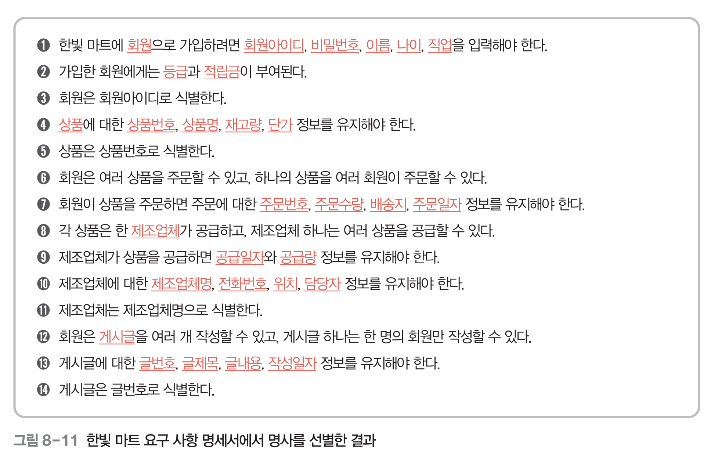
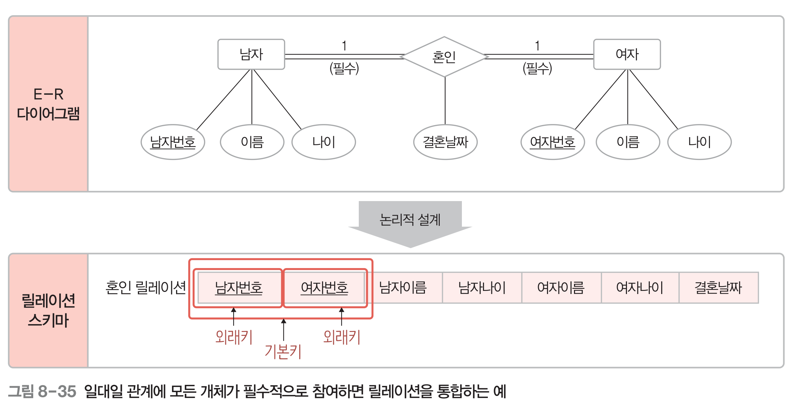

# 1. 데이터베이스 설계 단계

사용자의 요구 사항을 고려하여 데이터베이스를 생성하는 과정이다.

품질 좋은 데이터베이스를 평가하는 기준에 여러 가지가 있겠지만 실제로 디비를 사용하는 구성원들의 요구사항을 만족했는지가 대표 기준이 된다.

그 외에도 데이터의 일관성, 무결성을 유지하면서 사용자가 이해하기 쉽고 접근하기 편한지도 좋은 데이터베이스의 기본 요건에 든다.

관계 데이터 모델을 기반으로 데빙터베이스를 설계할 때에는 두 가지 방법을 주로 사용한다.

1. E-R모델과 릴레이션 변환 규칙을 이용한 데이터베이스 설계(ch 8)
2. 정규화를 이용한 데이터베이스 설계(ch 9)

1번을 이용한 설계는 5단계로 이루어진다.

1. 요구사항 분석
- 요구 사항 분석 후 요구사항 명세서 작성

<br>

2. 개념적 설계
- 요구사항 명세서를 바탕으로 시작. 개념적 데이터 모델(ex) 개체-관계 모델)을 사용.
- **개념적 데이터 모델은 DBMS의 종류에 독립적**이면서, 개체 간의 관계를 표현할 때 사용.
- 요구사항 명세서를 개념적 데이터 모델로 변환하는 것을 개념적 모델링이라고 하고,
  개념적 모델링의 결과물을 **개념적 구조**, **개념적 스키마**라고 한다.
  → E-R 다이어그램이 개념적 구조, 개념적 스키마

<br>


3. 논리적 설계
- 개발에 사용할 DBMS에 맞게 개념적 구조를 기반으로 논리적 구조를 설계한다.
- 일반적으로 **관계 데이터 모델**을 많이 사용한다.
- E-R 다이어그램을 릴레이션(테이블) 스키마로 변환하여 DBMS가 처리할 수 있도록 한다.
- E-R 다이어그램을 릴레이션 스키마로 변환하는 작업을 논리적 모델링(데이터모델링)이라고 한다.
- 논리적 데이터 모델로 표현된 결과물이 논리적 구조 or **논리적 스키마**.

<br>

4. 물리적 설계
- 데이터베이스를 저장 장치에 실제로 저장하기 위한 내부 저장 구조와 접근 경로 등을 의미한다.
- 저장장치에 적합한 **저장 레코드**, **인덱스의 구조** 등을 설계하고, 저장된 데이터와 인덱스에 빠르게 접근하게 할 수 있는 **탐색 기법** 등을 정의한다.
- 컴퓨터 시스템의 저장장치와 운영체제의 특성을 고려하여 효율적인 성능을 지원하도록 해야 한다.
- 응답 시간을 최소화하고 저장공간을 효율적으로 활용하면서 데이터베이스 시스템의 처리능력을 향상시킬 수 있도록 설계해야 한다.
- 물리적 설계의 결과물인 물리적 구조를 **내부스키마** or 물리적 스키마라 한다.

<br>

5. 구현
- 1~4단계의 결과물을 기반으로 DBMS에서 SQL로 작성한 명령문(DDL)을 실행하여 데이터베이스를 실제로 생성한다


1~3단계가 핵심.

# 2. 요구 사항 분석

데이터베이스의 용도를 파악 해서 요구사항 명세서를 만들어내는 단계이다

데이터베이스를 사용할 사용자의 범위를 결정해서 불필요한 요구 사항을 수집하지 않도록 한다.

사용자 범위가 결정되면, 사용자의 업무를 분석해서 어떤 데이터가 필요하고, 그 데이터에 어떤 처리가 필요한지를 분석한다. 이를 요구 사항 명세서로 문서화한다.


# 3. 개념적 설계

요구 사항 명세서를 개념적 데이터 모델을 이용해 표현한다.

요구 사항 명세서에서 **의미가 있는 데이터 요소(개체)를 추출하고 데이터간 관계를 파악하여 표현**한다. → 관계를 표현하는 것이기 때문에 DBMS의 종류를 따질 필요가 없는 것이다.

이 관계는 E-R 모델을 이용해 표현하고, 그 **결과물이 E-R 다이어그램(개념적 스키마)**.

과정

## 1) 개체와 속성 추출

요구 사항 명세서에서 개체를 추출한다.

일반적으로 요구 사항 문장의 **명사**가 개체인 경우가 많다.

의미가 같은 명사가 여러 개면 대표 명사 하나만 선택하고, 일반적이고 광범위한 의미의 명사는 제외한다.

걸러낸 의미있는 명사들을 **개체와 속성으로 또 분류 해야한다.**

```
ex)
한빛 마트(광범위한 의미의 명사이므로 제외)에 회원(개체)으로 가입하려면 회원아이디, 비밀번호, 이름, 나이, 직업(속성)을 입력해야 한다.
```

‼️  추출한 속성 중에서는 개체의 속성이 아닌 것도 있다.

ex) 회원이 상품을 주문하면 주문에 대한 주문번호, 주문수량, 배송지, 주문일자 정보를 유지해야 한다.

→ 주문 일자는 속성이지만, 회원이나 상품 개체에 항상 속해 있는 속성으로 보기는 어렵고, 특정 **관계의 속성**으로 판단할 가능성이 높다.



요구사항 명세서에 없는 개체와 속성을 추가할 수도 있지만, 개체와 속성을 추출할 때 조직의 업무 처리와 관련이 깊은 것부터 추출하도록 하자.


이하 동일.

## 2) 관계 추출

요구 사항 명세서에서 동사를 찾자.

조직의 업무 처리와 관련하여 **개체 간** 연관성을 의미 있게 표현한 동사를 찾고, 의미가 같은 동사가 여러 개면 대표 동사 하나만 선택.

관계를 추출한 후에는 추출한 관계에 대한 매핑 카디널리티와 참여 특성을 결정한다.(일대일, 일대다... 필수적 참여, 선택적 참여..)

‼️ 동사이더라도 개체나 속성을 설명하는 동사이면 관계가 될 수 없다.

ex)
가입한 회원에게는 등급과 적립금이 부여된다. → 등급, 적립금 속성에 대한 설명
회원은 회원아이디로 식별한다. → 회원 개체를 설명

옳은 예)
`회원은 여러 상품을 주문할 수 있고, 하나의 상품을 여러 회원이 주문할 수 있다.`

→ 회원 **개체와** 상품 **개체가 맺는 관계에 대한 동사**이므로 주문 관계를 추출할 수 있다.
→ 하나의 상품을 여러 회원이 주문 가능 ⇒ 회원 개체와 상품 개체는 **다대다 관계**.
→ 회원이 상품을 반드시 주문해야 하는 건 아니므로 **회원개체는 주문관계에 선택적 참여**.

`각 상품은 한 제조업체가 공급하고, 제조업체 하나는 여러 상품을 공급할 수 있다.`

→ 상품과 제조업체가 맺는 공급 관계는 일대다 관계.
→ 상품은 공급관계에 필수적 참여. 제조업체는 선택적 참여.

`제조업체가 상품을 공급하면 공급일자와 공급량 정보를 유지해야 한다.`

→  ‘유지해야 한다’라는 동사가 상품 개체와 제조업체 개체간의 관계를 표현하는 동사로 볼 수 없다.
→ 공급일자, 공급량은 **공급 관계를 설명하는 속성이므로 공급 관계의 속성**으로 분류한다.


주문 관계에서 모든 상품개체가 특정 주문 관계에 참여해야 하는 게 아니므로 선택적


관계 속성이 포함된 문장을 버리는 게 아님.


## 3) E-R 다이어그램 작성

위에서 요구 사항 명세서에서 추출한 개체, 속성, 관계를 개별적으로 그려냈는데, 그걸 하나의 E-R 다이어그램으로 합친 것. 개념적 설계 단계의 결과물인 개념적 스키마.


# 4. 논리적 설계

DBMS에 적합한 논리적 데이터 모델을 이용. 대표적으로 관계 데이터 모델 → 릴레이션으로 표현하는 거.

관계 데이터 모델을 이용해서 개념적 설계 단계의 결과물인 **E-R다이어그램을** 관계 데이터 모델의 **릴레이션 스키마**, 즉 **테이블 스키마로 변환**하는 작업을 하는 단계이다.

E-R 모델에서는 개체와 관계를 구분하지만 관계 데이터 모델에서는 개체와 관계를 구분하지 않고 모두 릴레이션으로 표현한다.

그리고 E-R 모델에서는 다중 값 속성이나 복합 속성의 표현을 허용하지만, 관계 데이터 모델에서는 다중 값 속성과 복합 속성의 표현을 허용하지 않는다.

이러한 차이 때문에 변환시 고려할 점이 많다.

## 1) 릴레이션 스키마 변환 규칙

### 1-1) 규칙1. 모든 개체는 릴레이션으로 변환한다.

E-R다이어그램의 각 개체를 하나의 릴레이션으로 변환
→ 개체 이름이 릴레이션 이름, 개체 속성이 릴레이션 속성. 단, 개체가 가진 복합 속성은 이를 구성하는 단순 속성만 릴레이션의 속성으로 변환한다.
→ 개체의 키는 릴레이션의 기본키로 변환.


릴레이션 스키마는 아래와 같이 표현할 수도 있다.

```
상품(상품번호, 상품명, 재고량, 단가)
```

복합 속성을 릴레이션 스키마로 변환할 때는 아래와 같이 표현할 수 있다.


### 1-2) 규칙2. 다대다 관계는 릴레이션으로 변환한다.

관계의 이름을 리레이션 이름으로 하고, 관계 속성도 릴레이션의 속성으로 그대로 변환한다.

단 관계를 맺고 있는 개체가 무엇인지가 중요하므로, 관계를 맺고 있는 개체들을 규칙1에 따라 변환한 후 이 릴레이션들의 기본키를 관계 릴레이션에 포함시키고 외래키로 지정한다.

그리고 이 외래키들을 조합하여 관계 릴레이션의 기본키로 지정한다.


관계에 참여하는 릴레이션들의 기본키를 다대다 관계 릴레이션의 외래키로 등록하고, 그 외래키들을 이용해 기본키를 만들거나, 기본키를 따로 둘 수도 있다.

### 1-3) 규칙3. 일대다 관계는 외래키로 표현한다

일대다 관계는 릴레이션으로 변환하지 않고 외래키로만 표현한다. 단 약한 개체가 참여하는 일대다 관계는 일반 개체가 참여하는 경우와 다르게 처리한다.

### 1-3-1) 일반적인 일대다 관계는 외래키로 표현

1측 개체의 릴레이션에 n측 개체 릴레이션의 기본키를 외래키로 포함시키면, 1측에 외래키가 다중 값을 가지게 되는 것이므로 릴레이션 특성 위반. → 반대로 n측(상품) 외래키에 1측(제조업체)의 기본키를 포함시켜야 한다.


‼️  관계의 관계 속성도 n측 개체의 릴레이션 속성으로 추가한다(공급 - 공급수량)

### 1-3-2) 약한 개체가 참여하는 일대다 관계는 외래키를 포함해서 기본키로 지정한다

1-3-1 규칙과 똑같이 1측 기본키를 n측 외래키로 포함시킨다.

다른점은 n측 릴레이션에서 외래키를 포함하여 기본키를 지정해야 한다는 점이다. 즉 n측 개체 릴레이션이 가지고 있던 기본키와 외래키를 조합하여 기본키로 지정해야 한다.

→ 약한 개체는 강한 개체에 따라 존재 여부가 결정되는 만큼 강한 개체의 기본키를 이용해 식별하는 것


생각해보면 되게 자연스러운 흐름이다. 비행기가 없으면 존재하지도 않을 좌석이고, 좌석 번호만 달랑 설정해 두면 어디에 놓이는 좌석인지도 모를 좌석이 된다. A비행기의 좌석인지 B비행기이 좌석인지, 대합실의 좌석인지..

### 1-4) 규칙 4. 일대일 관계는 외래키로 표현한다

일대다와 마찬가지로 관계를 릴레이션으로 변환하지 않고 외래키로 표현한다.

각 개체가 서로를 외래키로 등록해도 되지만 굳이 그럴 필요는 없다. 한쪽만 외래키를 가져도 관계를 표현하기에 충분하다. 관계가 가지는 속성도 한쪽 릴레이션만 가져도 된다.

그러면 두 릴레이션 중 어떤 릴레이션에 외래키와 관계 속성을 포함시키면 좋을까?

### 1-4-1) 관계에 필수 참여하는 개체의 릴레이션만 외래키를 받는다(속성도)

관계에 선택 참여하는 개체가 외래키를 받으면 외래키에 NULL값이 들어갈 수 있으므로 좋지 않다.

만약 두 개체가 모두 선택 참여하는 관계라면 어느 릴레이션에 외래키를 포함시켜도 관계 없다. 하지만

### 1-4-2) 모든 개체가 일대일 관계에 필수적으로 참여하면 릴레이션 하나로 합친다

두 개체가 모두 관계에 필수 참여한다면 그만큼 두 개체가 관련성이 있는 개체라는 의미이므로 두 릴레이션을 하나로 합쳐 표현한다.
→ 관계의 이름을 이름으로 사용하고, 관계에 참여하는 두 개체의 속성들도 관계 릴레이션에 모두 포함시킨다.
→ 두 개체 릴레이션의 키 속성을 조합하여 관계 릴레이션의 기본키로 지정한다.



⇒ 혼인이라는 관계를 릴레이션으로 만들고, 남자개체, 여자개체 릴레이션의 속성을 혼인 릴레이션에 포함시킨다. 관계의 속성도 관계 릴레이션이 가지고 있는다.

### 1-5) 규칙 5. 다중 값 속성은 릴레이션으로 변환한다.

관계 데이터 모델은 릴레이션에 다중 값을 가지는 속성을 허용하지 않으므로 별도의 릴레이션을 만들어 다중 속성을 가지고 있던 개체에 포함시킨다.


부하직원 → 다중 값 속성(이중 타원)


관계 데이터 모델에서 표현할 수 없는 방식. 이를 아래와 같이 바꿔 표현한다.


다중값 속성 릴레이션인 사원-부하직원 릴레이션은 상사의 사원번호와 부하직원의 이름?을 외래키로 받아서, 그 둘을 조합해 기본키로 만들어 사용한다.

### 1-6) 기타 고려사항

**다대다 외의 관계를 릴레이션으로 변환하고 싶다면**

일대일 관계를 1-4번처럼 외래키로 표현할 수도 있지만 관계를 릴레이션으로 따로 빼서 관리할 수도 있다.

하지만 다대다 외의 관계를 모두 릴레이션으로 변환해버리면 생성되는 릴레이션의 개수가 많아져 릴레이션을 관리해야 할 DBMS의 부담이 커진다.

→ 외래키만으로도 표현이 가능한 일대일, 일대다 관계는 릴레이션으로 변환하지 않는 게 좋다.

**순환 관계**

순환 관계도 기본 규칙을 따른다. → 다대다는 릴레이션으로, 일대일, 일대다는 외래키로 표현.


상사 한명(1)이 여러명의 부하직원(n)을 관리하므로 n측에 1측의 기본키를 외래키를 두는 일대다 규칙을 그대로 보여주고 있는 그림이다.

그리고 기본키와 외래키의 이름이 같으면 안되니까 같은 사원 번호이더라도 이름을 달리 해준 것을 볼 수 있다.

Q. 하나의 개체만 관계에 참여하는 순환 관계라는 게, 상사도, 부하직원도 결국 사원 개체이고, 사원 개체간의 관계이므로 순환 관계라는 것?

## 2) 릴레이션 스키마 변환 규칙을 이용한 논리적 설계

위의 규칙을 한빛마트 예제에 적용해보는 내용.

# 5. 물리적 설계와 구현

논리적 설계 단계에서 릴레이션 스키마 설계를 완료하면 이를 기반으로

4단계 물리적 설계 단계에서 하드웨어나 운영체제의 특성을 고려해서 필요한 인덱스 구조나 내부 저장 구조 등에 대한 물리적인 구조를 설계하고,

5단계 구현 단계에서 SQL문을 DBMS에서 실행하여 데이터베이스를 생성한다.


