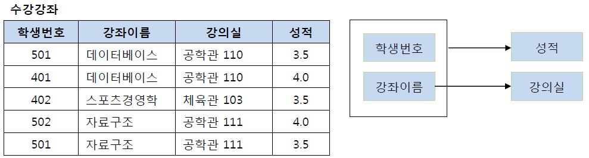

# 09 정규화

# 1. 정규화의 개념과 이상 현상

## 1. 정규화의 개념

정규화는 데이터베이스를 설계한 후 설계 결과물을 검증하기 위해 사용한다. 상황에 따라 E-R 모델과 정규화 중 적절한 방법을 선택하면 된다. 데이터베이스를 잘못 설계하면 불필요한 데이터 중복이 발생하여 릴레이션에 대한 데이터의 삽입, 수정, 삭제 연산을 수행할 때 부작용이 발생할 수 있다. 이러한 부작용을 `이상현상`이라 하며, 이상현상을 제거하면서 데이터베이스를 올바르게 설계해나가는 과정을 `정규화`라고 한다.

## 2. 이상현상의 종류

- 삽입 이상 : 새 데이터를 삽입하기 위해 불필요한 데이터도 함께 삽입해야 하는 문제
- 갱신 이상 : 중복 투플 중 일부만 변경하여 데이터가 불일치하게 되는 모순의 문제
- 삭제 이상 : 투플을 삭제하면 꼭 필요한 데이터까지 함께 삭제되는 데이터 손실의 문제

## 3. 정규화의 필요성

릴레이션에 여러 이상 현상이 발생하는 이유는 관련이 없는 데이터 속성들을 하나의 릴레이션에 모아두고 있기 때문이다. 정규화를 수행하려면 릴레이션을 구성하는 속성들 간의 관련성을 판단할 수 있어야 한다. 정규화 과정에서 고려해야 하는 속성들 간의 관련성을 `함수적 종속성` 이라고 한다. 일반적으로 릴레이션에 함수적 종속성이 하나 존재하도록 정규화를 통해 릴레이션을 분해한다.

# 2. 함수 종속

- **X가 Y를 함수적으로 결정한다**
    - 릴레이션 내의 모든 투플에서 하나의 X 값에 대한 Y 값이 항상 하나이다.
    - X와 Y는 하나의 릴레이션을 구성하는 속성들의 부분 집합
    - “Y가 X에 함수적으로 종속되어 있다”와 같은 의미
    - X → Y로 표현(X는 결정자, Y는 종속자)

### 함수 종속의 예

- **각 고객아이디 속성 값에 대응되는고객이름 속성과 등급 속성 값이 단 하나이다.**

- **함수 종속 관계는 아래와 같이 기호로 표현할 수 있다.**

### 함수 종속 관계의 유의점

- 현재 시점에 릴레이션에 포함된 속성 값만으로 판단하면 안됨
- 속성 자체가 가지고 있는 특성과 의미를 기반으로 판단해야 함
- 일반적으로 기본키와 후보키는 릴레이션의 다른 모든 속성들을 함수적으로 결정함
- 기본키나 후보키가 아니어도 다른 속성 값을 유일하게 결정하는 속성은 함수 종속 관계에서 결정자가 될 수 있음

### 완전 함수 종속

- 릴레이션에서 속성 집합 Y가 속성 집합 X 전체에 종속된 것
- 일반적으로 함수 종속은 완전 함수 종속을 의미함

### 부분 함수 종속

- 릴레이션에서 속성 집합 Y가 속성 집합 X의 전체가 아닌 일부분에 종속된 것

# 3. 기본 정규형과 정규화 과정

## 1. 정규화의 개념과 정규형의 종류

정규화의 기본 목표는 관련이 없는 함수 종속성은 별개의 릴레이션으로 표현하는 것이다.

릴레이션이 정규화된 정도는 `정규형`으로 표현한다.

- 정규형마다 만족시켜야 하는 제약조건이 존재함
- 정규형의 차수가 높아질수록 요구되는 제약조건이 많아지고 엄격해짐
- 릴레이션의 특성을 고려해서 적합한 정규형을 선택

## 2. 제 1 정규형

> 릴레이션에 속한 모든 속성의 도메인이 원자 값으로만 구성되어 있으면 제 1 정규형에 속한다.
> 

- 릴레이션의 모든 속성이 더는 분해되지 않는 원자 값만 가지면 제 1 정규형을 만족함
- 제 1 정규형을 만족해야 관계 데이터베이스의 릴레이션이 될 자격이 있음
- 가로로 길어지지 않고 세로로 길어져야 함

- 제 1 정규형을 만족하지 못함
- 속성이 원자 값이 아님

- 제 1 정규형을 만족함
- 속성이 원자 값만 가짐
- 

## 3. 제 2 정규형

> 릴레이션이 제 1 정규형에 속하고, 기본키가 아닌 모든 속성이 기본키에 완전 함수 종속되면 제 2 정규형에 속한다.
> 

- 부분 함수 종속을 제거하고 모든 속성이 기본키에 완전 함수 종속되도록 릴레이션을 분해한다.
- 완전 함수 종속이라는 것은 기본키의 부분집합이 결정자가 되어선 안된다는 것을 의미한다.

- (학생번호, 강좌이름) 기본키
- (학생번호, 강좌이름) → 성적
    - 강좌이름 → 강의실 도 가능하다 / 기본키의 부분집합인 강좌이름이  강의실을 결정함 / 부분함수종속

- 강좌 이름 → 성적 테이블로 분리 / 2 정규형 만족

## 4. 제 3 정규형

> 릴레이션이 제 2 정규형에 속하고, 기본키가 아닌 모든 속성이 기본키에 이행적 함수 종속이 되지 않으면 제 3 정규형에 속한다.
> 

- 제 2 정규형에 속하는 릴레이션이 제 3 정규형을 만족하게 하려면?
    - 모든 속성이 기본키에 이행적 함수 종속이 되지 않도록 분해
- A → B , B → C 가 성립할 때 A → C 성립된다는 것을 의미

- 학생번호 → 강좌이름, 강좌이름 → 수강료 / 이행적 함수종속

- 학생 번호를 통해 강좌 이름을 참조하고, 강좌 이름으로 수강료를 참조하도록 테이블을 분해
- 모든 속성이 기본키에 이행적 함수 종속이 되지 않음

## 5. 보이스 / 코드 정규형 ( BCNF)

> 릴레이션의 함수 종속 관계에서 모든 결정자가 후보키이면 보이스/코드 정규형에 속한다.
> 

- 제 3 정규화를 진행한 테이블에 대해  모든 결정자가 후보키가 되도록 테이블을 분해하는 것.

- (학생번호, 특강이름) 기본키
- (학생번호, 특강이름) → 교수
- 교수 → 특강이름 / 교수가 특강이름을 결정하지만 후보키가 아님

- 특강신청 테이블과 특강교수 테이블로 분해
