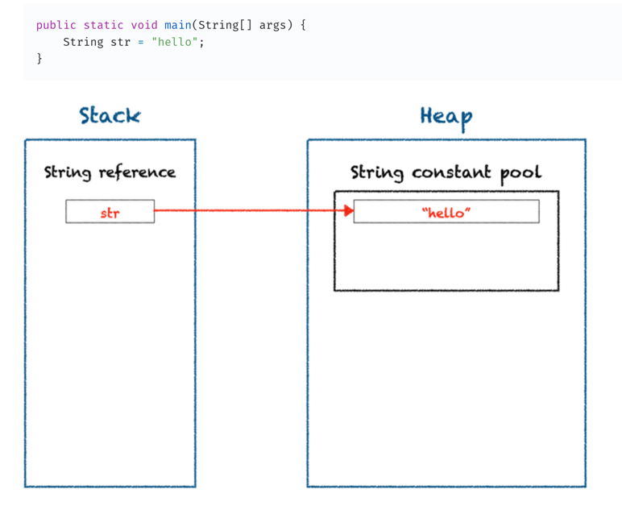
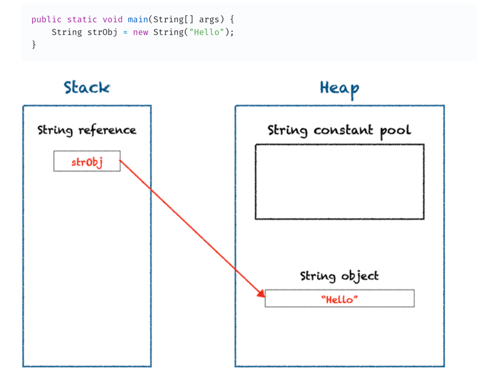

## 문자열 상수

자바 힙 영역에는 문자열 상수 풀(String Constant Pool)이라는 문자열 리터럴을 저장하는 저장 공간이 있습니다. JVM(Java Virtual Machine)은 이 공간을 이용하여 메모리 공간을 효율적으로 관리합니다. 우리가 문자열 리터럴을 이용하여 String 객체를 생성할 때 JVM은 다음과 같이 동작합니다.

문자열 상수 풀에 동일한 문자열("hello")이 이미 존재하는지 확인한다.
문자열 상수 풀에 문자열이 있다면, 해당 문자열에 대한 참조를 반환한다.
문자열 상수 풀에 문자열이 없다면, 풀에 새로운 문자열을 생성하고 문자열에 대한 참조 값을 반환한다.

### String 상수 풀의 메모리 내 위치
* heap 메모리 영역에 존재한다.

### 주의사항
new 키워드를 이용하여 String 객체를 생성할 때에는 문자열이 문자열 상수 풀에 저장되지 않습니다. new 키워드를 사용할 때 JVM은 힙 영역에 새로운 String 객체를 생성합니다. 따라서 메모리 공간 효율(재사용성)을 고려한다면 문자열을 생성할 때 new 키워드보다 문자열 리터럴을 사용하는 것이 더 좋습니다.

## StringBuffer/StringBuilder와 String클래스의 차이점

* StringBuffer/StringBuilder는 append하더라도 처음 생성된 메모리 영역을 계속 사용.
* String클래스는 문자열이 달라지면 힙 메모리 영역 안에 있는 문자열 상수풀에 새로운 문자열 상수를 새로 생성. -> 추가적인 메모리 사용.

## StringBuffer와 StringBuilder의 차이
* StringBuffer : Thread-safe
* StringBuilder : Thread-non safe
