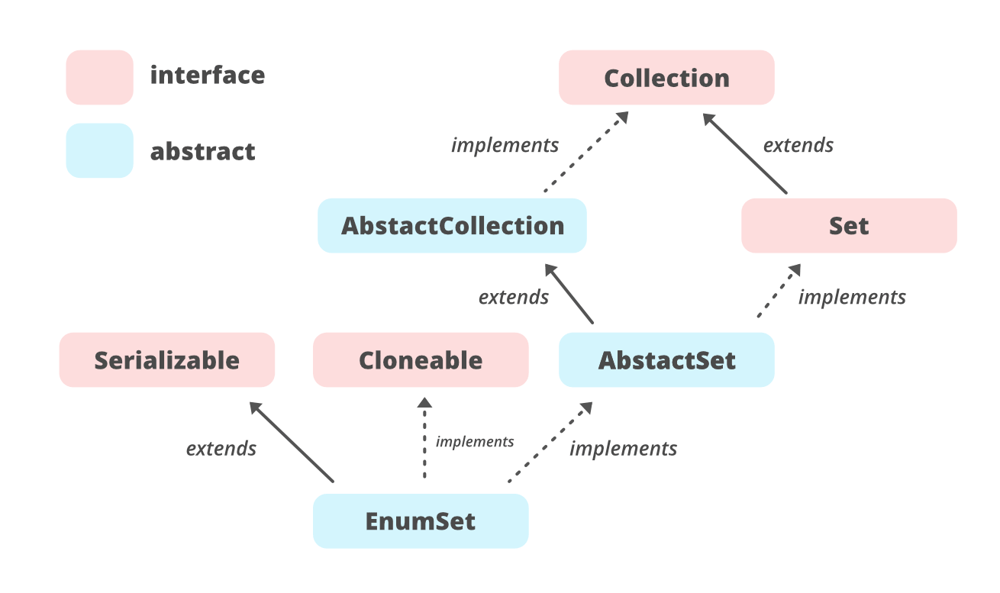

## Java Enum의 특징
 
1. enum에 정의된 상수들은 해당 enum type의 객체이다.

C 등의 다른 언어에도 열거형이 존재한다. 하지만 다른 언어들과 달리 Java의 enum은 단순한 정수 값이 아닌 해당 enum type의 객체이다.

 
2. 생성자와 메서드를 추가할 수 있다.

enum의 생성자의 접근제어자는 private이기 때문에 외부에서 상수를 추가할 수 없다. 열거형의 멤버 중 하나를 호출하면, 열거된 모든 상수의 객체가 생성된다. 위 예시를 보면 APPLE 하나를 호출했는데 열거된 모든 상수의 생성자가 호출되었음을 확인할 수 있다. 상수 하나당 각각의 인스턴스가 만들어지며 모두 public static final이다.

생성자를 이용해서 상수에 데이터를 추가할 수 있다. (예제)

 
3. 상수 간의 비교가 가능하다.

enum 상수 간의 비교에는 ==를 사용할 수 있다. 단 >, < 같은 비교연산자는 사용할 수 없고 compareTo()를 사용할 수 있다.

## Enum 주요 메서드
* T[] values() : 해당 enum 타입에 정의된 상수 배열을 반환한다.
* String name() : 열거형 상수의 이름을 문자열로 반환한다.
* T valueOf(Class<T> enumType, String name) :  지정된 열거형에서 name과 일치하는 열거형 상수를 반환한다.

## java.lang.Enum
java.lang 에 포함된 Enum 클래스는 모든 자바 열거형의 조상이다. 모든 열거형은 Enum 클래스를 상속받기 때문에 enum type은 별도의 상속을 받을 수 없다

## EnumSet
EnumSet 열거형을 위해 고안된 특별한 Set 인터페이스 구현체이다.HashSet과 비교했을 때, 성능 상의 이점이 많기 때문에 열거형 데이터를 위한 Set이 필요한 경우 EnumSet을 사용하는 것이 좋다.

EnumSet의 상속 구조는 다음과 같다

## EnumSet의 주요 특징

* EnumSet은 AbstractSet 클래스를 상속하고 Set 인터페이스를 구현한다.
* 오직 열거형 상수만을 값으로 가질 수 있다. 또한 모든 값은 같은 enum type이어야 한다.
* null value를 추가하는 것을 허용하지 않는다. NullPointerException을 던지는 것도 허용하지 않는다.
* ordinal 값의 순서대로 요소가 저장된다.
* tread-safe하지 않다. 동기식으로 사용하려면 Collections.synchronizedMap을 사용하거나, 외부에서 동기화를 구현해야한다.
* 모든 메서드는 arithmetic bitwise operation을 사용하기 때문에 모든 기본 연산의 시간 복잡도가 O(1)이다.
