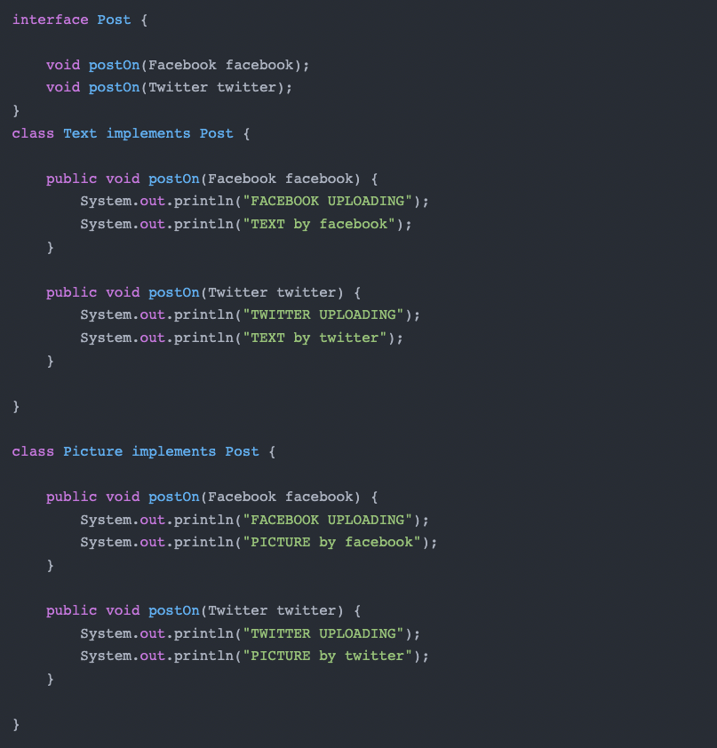
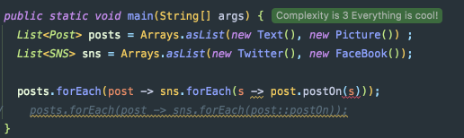
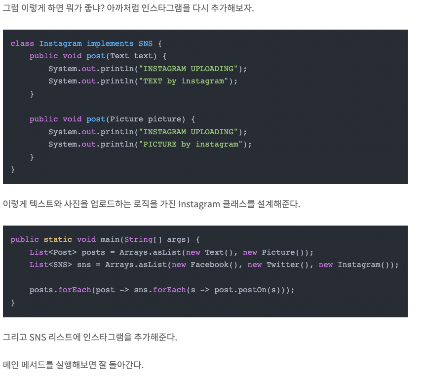
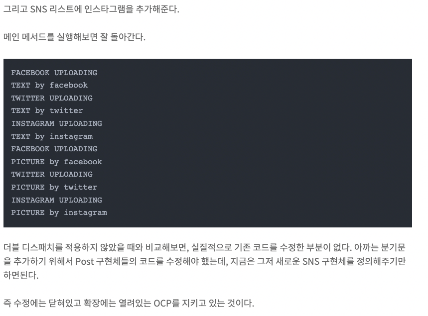

## Dependency 의존성
하나의 클래스 A 가 있다.

다른 클래스 B 가 있다.

B 클래스의 내부 구현에서 A 클래스로 인스턴스를 만들었다.

B 클래스 내부에서 만든 A 의 인스턴스로 A 클래스의 메서드도 사용했다.

그렇게 에플리케이션을 잘 사용하다가, A 클래스의 메서드를 삭제했다.

그럼 B 클래스는 어떻게 될까?

당연히 오류를 뱉을 것이다.

B는 A를 사용하고 있었으니까.

이렇게 B 가 A를 사용하고 있는 상태를 B 는 A를 의존한다 라고 하고, 두 클래스는 의존관계가 있으며 이런 것을 의존성이라 한다.

  

**디스패치란 어떤 메서드를 호출할 것인가 를 결정하는 과정을 말한다.
즉 메서드의 의존성을 결정하는 과정이라 할 수 있다.**

출처: https://alkhwa-113.tistory.com/entry/디스패치-다이나믹-디스패치-더블-디스패치 [기(술) 블로그]

 

### Static Dispatch(오버로딩) 
* 컴파일 시점에서, 컴파일러가 특정 메소드를 호출할 것이라고 명확하게 알고있는 경우이다. (정적)

 

### Dynamic Dispatch(오버라이딩)
- 정적 디스패치와 반대로 컴파일러가 어떤 메서드를 호출하는지 모르는 경우이다. 동적 디스패치는 호출할 메서드를 런타임 시점에서 결정한다. 

  

postOn 메서드에 인자를 받는 부분에서 빨간줄이 그여져있는 것을 확인할 수 있다. 에러 메시지를 보면 "SNS 객체를 받는 postOn 메서드를 찾을 수 없다"며 컴파일 타임에서 에러를 내고 있다.

분명 Post의 postOn 메서드에 Facebook 객체와 Twitter 객체를 매개변수로 받는 메서드를 정의해주고 객체도 잘 넘겨줬는데, 메서드를 찾을 수 없다고 말하는걸까?

그 이유는, 메서드 오버로딩은 정적 메서드 디스패치를 하기 때문이다. 오버로딩된 메서드는 컴파일 시점에서 정확히 타입 체크를 하고 어떤 메서드를 실행할지 알아야 하는데, 메인 메서드의 forEach문을 보면 매개변수로 Facebook이나 Twitter같은 특정 타입이 아니라 SNS 객체를 넘겨주고 있기 때문에, 어떤 메서드를 실행할지 결정할 수 없는 것이다.

 
forEach의 s가 SNS타입 -> 정적 dispatch가 이루어지는 오버로딩의 경우 Twitter와 FaceBook타입을 인자로 받을 것이 정해져있기 때문에
타입 에러가 남.

  
### 더블 디스패치로 코드 수정
..중략..

